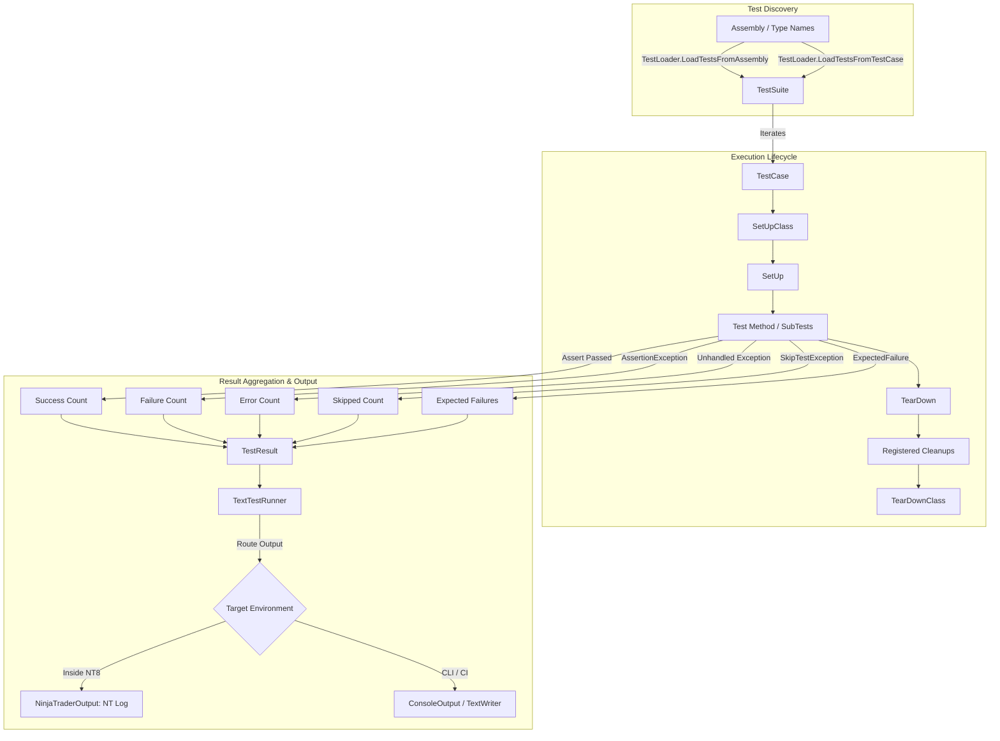

# NinjaTrader.UnitTest

[]()
[]()
[]()
[]()
[]()
[](LICENSE.txt)

`NinjaTrader.UnitTest` is a lightweight, institutional-grade unit testing framework and mocking kit designed specifically for **NinjaTrader 8** (NT8). Modeled after Python's `unittest` standard library (`TestCase`, `TestSuite`, `TestLoader`, `TextTestRunner`, `Assert`, `SubTest`), it brings Python-style testing elegance and workflow productivity to C# algorithmic trading, custom indicators, automated strategies, and NinjaTrader Add-Ons.

---

## 📚 Complete Documentation

Detailed guides and API references are available in the **[`docs/`](file:///C:/Users/samuel/source/repos/NT/refs/ninjatrader-unittest/docs/README.md)** directory:

- 🚀 **[Getting Started Guide](file:///C:/Users/samuel/source/repos/NT/refs/ninjatrader-unittest/docs/getting-started.md)**: Setup, build, deployment, writing your first test case, and execution.
- 💡 **[Core Testing Concepts](file:///C:/Users/samuel/source/repos/NT/refs/ninjatrader-unittest/docs/core-concepts.md)**: `TestCase` lifecycle fixtures (`SetUp`, `TearDown`, `SetUpClass`, `TearDownClass`, `AddCleanup`), dynamic skipping (`[Skip]`, `[SkipIf]`, `[SkipUnless]`, `SkipTest`), expected failures (`[ExpectedFailure]`), and `SubTest` parameterized scenarios.
- 🔍 **[Comprehensive Assertion Reference](file:///C:/Users/samuel/source/repos/NT/refs/ninjatrader-unittest/docs/assertions-reference.md)**: Complete catalog of assertions with Python parity, C# / NUnit aliases, tolerance comparisons, and exception testing.
- 🛠️ **[Mocking & Harness Kit](file:///C:/Users/samuel/source/repos/NT/refs/ninjatrader-unittest/docs/mocking-kit.md)**: Synthetic OHLCV series (`BarSeriesBuilder`, `MockBarSeries`), multi-asset instruments (`MockInstrument`), accounts and orders (`MockAccount`, `MockOrder`, `MockPosition`), and the `NinjaScriptTestHarness`.
- 📊 **[Test Runners & Logging](file:///C:/Users/samuel/source/repos/NT/refs/ninjatrader-unittest/docs/test-runners-logging.md)**: Reflection test discovery (`TestLoader`), `TextTestRunner`, verbosity modes (0, 1, 2), fail-fast mode, and pluggable output targets (`NinjaTraderOutput`, `ConsoleOutput`, `TextWriterOutput`).
- 🤖 **[CI/CD & Headless Automation](file:///C:/Users/samuel/source/repos/NT/refs/ninjatrader-unittest/docs/cicd-automation.md)**: Headless test runner scripts and GitHub Actions / CI/CD pipelines.
- 🏛️ **[Architecture & Design Standards](file:///C:/Users/samuel/source/repos/NT/refs/ninjatrader-unittest/docs/architecture-design.md)**: SOLID principles, Object Calisthenics, Fail-Fast mechanisms, and Failure vs. Error classification.

---

## Key Features

- **Full Python `unittest` Parity:**
  - Standard abstractions: [`TestCase`](file:///C:/Users/samuel/source/repos/NT/refs/ninjatrader-unittest/src/Execution/TestCase.cs), [`TestSuite`](file:///C:/Users/samuel/source/repos/NT/refs/ninjatrader-unittest/src/Execution/TestSuite.cs), [`TestLoader`](file:///C:/Users/samuel/source/repos/NT/refs/ninjatrader-unittest/src/Discovery/TestLoader.cs), [`TextTestRunner`](file:///C:/Users/samuel/source/repos/NT/refs/ninjatrader-unittest/src/Results/TextTestRunner.cs), and [`SubTest`](file:///C:/Users/samuel/source/repos/NT/refs/ninjatrader-unittest/src/Execution/SubTest.cs).
  - Lifecycle hooks: `SetUp()`, `TearDown()`, `SetUpClass()`, `TearDownClass()`, and `AddCleanup(action)`.
  - Conditional skipping via `SkipTest(reason)` and attributes (`[Skip]`, `[SkipIf]`, `[SkipUnless]`).
  - Expected failure support via `[ExpectedFailure]`.
- **Automatic Test Discovery:**
  - Auto-discovers methods prefixed with `Test*` or `test_*`.
  - Auto-discovers methods decorated with `[Test]` or `[TestMethod]`.
  - Supports loading by Type, Assembly, or qualified name.
- **Dedicated NinjaTrader Mocking & Harness Kit:**
  - **[`BarSeriesBuilder`](file:///C:/Users/samuel/source/repos/NT/refs/ninjatrader-unittest/src/Mocking/Bars/BarSeriesBuilder.cs) & [`MockBarSeries`](file:///C:/Users/samuel/source/repos/NT/refs/ninjatrader-unittest/src/Mocking/Bars/MockBarSeries.cs):** Fluent builder for synthetic OHLCV bars with NinjaTrader-style `Close(barsAgo)` reverse indexing.
  - **[`MockInstrument`](file:///C:/Users/samuel/source/repos/NT/refs/ninjatrader-unittest/src/Mocking/Instruments/MockInstrument.cs):** Presets for Futures (`ES`, `MES`), Equities (`AAPL`), Forex (`EURUSD`), and Crypto (`BTCUSD`) with tick rounding and PnL calculation.
  - **[`MockAccount`](file:///C:/Users/samuel/source/repos/NT/refs/ninjatrader-unittest/src/Mocking/Accounts/MockAccount.cs), [`MockOrder`](file:///C:/Users/samuel/source/repos/NT/refs/ninjatrader-unittest/src/Mocking/Orders/MockOrder.cs) & [`MockPosition`](file:///C:/Users/samuel/source/repos/NT/refs/ninjatrader-unittest/src/Mocking/Accounts/MockPosition.cs):** Order execution state machine simulating submissions, partial/full fills, cancellations, and realized/unrealized PnL.
  - **[`NinjaScriptTestHarness`](file:///C:/Users/samuel/source/repos/NT/refs/ninjatrader-unittest/src/Mocking/Harness/NinjaScriptTestHarness.cs):** Simulates NinjaScript state transitions (`SetDefaults` -> `Configure` -> `DataLoaded` -> `Historical` -> `Realtime`) and steps bar-by-bar through custom calculation logic without a chart.
- **Strict Error vs. Failure Separation:**
  - Assertion violations throw [`AssertionException`](file:///C:/Users/samuel/source/repos/NT/refs/ninjatrader-unittest/src/Exceptions/AssertionException.cs) (recorded as **Failures**).
  - Unhandled runtime crashes are cleanly isolated and recorded as **Errors**.
- **Pluggable Output System:**
  - Automatically logs to `NinjaTrader.NinjaScript.NinjaScript.Log` inside NinjaTrader 8.
  - Seamlessly falls back to `Console` or `TextWriter` for headless CLI or CI/CD pipelines.

---

## Architecture & Execution Flow



---

## Installation & Build

### Prerequisites
- Windows 10 or 11 (64-bit)
- .NET Framework 4.8 Developer Pack
- Visual Studio 2022 / MSBuild Tools
- NinjaTrader 8 (64-bit)

### Build Command
```powershell
# Build x64 Release (Recommended for NinjaTrader 8)
& "C:\Program Files (x86)\Microsoft Visual Studio\2022\BuildTools\MSBuild\Current\Bin\MSBuild.exe" NinjaTrader.UnitTest.sln /p:Configuration=Release /p:Platform="x64"
```

The project includes an automatic `PostBuildEvent` that copies the compiled `NinjaTrader.UnitTest.dll` and `.pdb` directly to `%USERPROFILE%\Documents\NinjaTrader 8\bin\Custom\`.

---

## Quick Start Example

Inherit from [`TestCase`](file:///C:/Users/samuel/source/repos/NT/refs/ninjatrader-unittest/src/Execution/TestCase.cs) to write tests:

```csharp
using System;
using System.Collections.Generic;
using NinjaTrader.UnitTest;
using NinjaTrader.UnitTest.Mocking;

public class MovingAverageStrategyTests : TestCase
{
    private MockBarSeries _bars;
    private MockInstrument _instrument;
    private MockAccount _account;

    public override void SetUp()
    {
        // 1. Configure mock instrument and account
        _instrument = MockInstrument.CreateFutures("ES", tickSize: 0.25, pointValue: 50.0);
        _account = new MockAccount("SimAccount", initialCash: 100000.0);

        // 2. Fluently construct synthetic OHLCV price series
        _bars = new BarSeriesBuilder("ES")
            .AddBar(open: 5000.0, high: 5010.0, low: 4995.0, close: 5005.0)
            .AddBar(open: 5005.0, high: 5020.0, low: 5000.0, close: 5015.0)
            .AddBar(open: 5015.0, high: 5025.0, low: 5010.0, close: 5020.0)
            .Build();
    }

    public void TestPriceSeriesIndexing()
    {
        // NinjaTrader reverse-indexing (0 is most recent bar)
        AssertEqual(5020.0, _bars.Close(0));
        AssertEqual(5015.0, _bars.Close(1));
        AssertEqual(5005.0, _bars.Close(2));
        AssertEqual(3, _bars.Count);
    }

    public void TestTradeExecutionAndPnL()
    {
        // Submit and fill Buy Limit order
        var buyOrder = _account.SubmitOrder(_instrument, MockOrderAction.Buy, MockOrderType.Limit, 2, 5000.0);
        _account.FillOrder(buyOrder, fillPrice: 5000.0, quantity: 2);

        AssertTrue(buyOrder.IsFilled);
        AssertEqual(2, _account.GetPosition(_instrument).Quantity);

        // Submit and fill Sell order to close position
        var sellOrder = _account.SubmitOrder(_instrument, MockOrderAction.Sell, MockOrderType.Market, 2);
        _account.FillOrder(sellOrder, fillPrice: 5010.0, quantity: 2);

        // Realized PnL: (5010 - 5000) * $50 pointValue * 2 contracts = $1,000.00
        AssertEqual(1000.0, _account.GetPosition(_instrument).RealizedPnL);
        AssertEqual(101000.0, _account.CashValue);
    }

    [Skip("Awaiting live exchange schedule")]
    public void TestLiveSessionTimeFilter()
    {
        // Skipped automatically
    }
}
```

### Executing Tests in NinjaTrader 8
```csharp
// Inside any AddOn, Strategy, or Indicator:
TestSuite suite = TestLoader.LoadTestsFromAssembly(GetType().Assembly);
TestResult result = TextTestRunner.Run(suite, verbosity: 2);
```

---

## Assertions Quick Reference

| Assertion | NUnit / C# Alias | Description |
| :--- | :--- | :--- |
| `AssertEqual(exp, act)` | `AreEqual` | Equality check (`EqualityComparer<T>.Default`). |
| `AssertNotEqual(exp, act)` | `AreNotEqual` | Inequality check. |
| `AssertTrue(cond)` | `IsTrue` | Asserts condition is true. |
| `AssertFalse(cond)` | `IsFalse` | Asserts condition is false. |
| `AssertIs(exp, act)` | `AreSame` | Reference equality check (`ReferenceEquals`). |
| `AssertIsNot(exp, act)` | `AreNotSame` | Asserts references differ. |
| `AssertIsNone(obj)` | `IsNull` | Asserts object is null. |
| `AssertIsNotNone(obj)` | `IsNotNull` | Asserts object is not null. |
| `AssertIn(item, coll)` | `Contains` | Asserts item is contained in collection. |
| `AssertNotIn(item, coll)` | `DoesNotContain` | Asserts item is not in collection. |
| `AssertAlmostEqual(e, a, p, d)` | `AreAlmostEqual` | Floating-point comparison by `places` or `delta`. |
| `AssertRaises<T>(action)` | `Throws<T>` | Asserts action throws exception `T`. |
| `AssertSequenceEqual(s1, s2)` | - | Asserts sequences match in elements and order. |
| `AssertCountEqual(c1, c2)` | - | Asserts collections match in element frequency. |

See the complete assertion catalog in the **[Assertions Reference Guide](file:///C:/Users/samuel/source/repos/NT/refs/ninjatrader-unittest/docs/assertions-reference.md)**.

---

## License

This project is licensed under the **MIT License**. See the [LICENSE.txt](LICENSE.txt) file for details.
