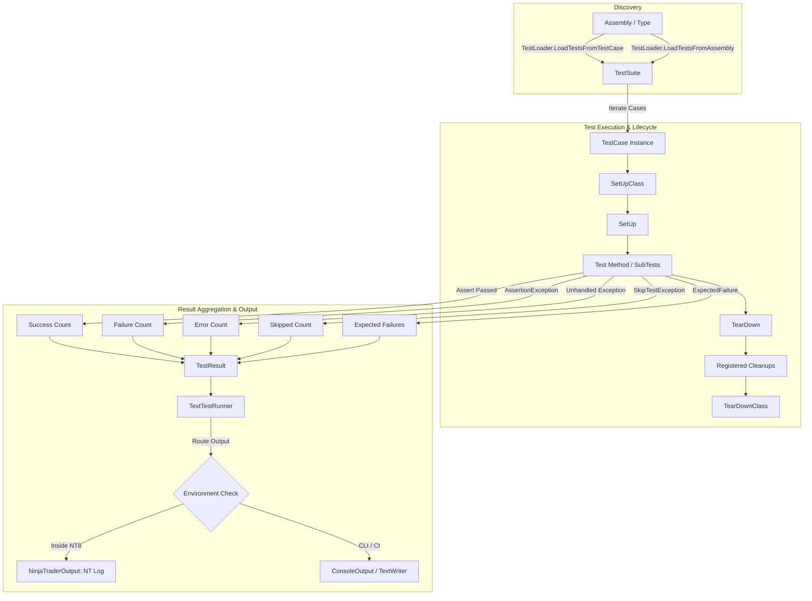
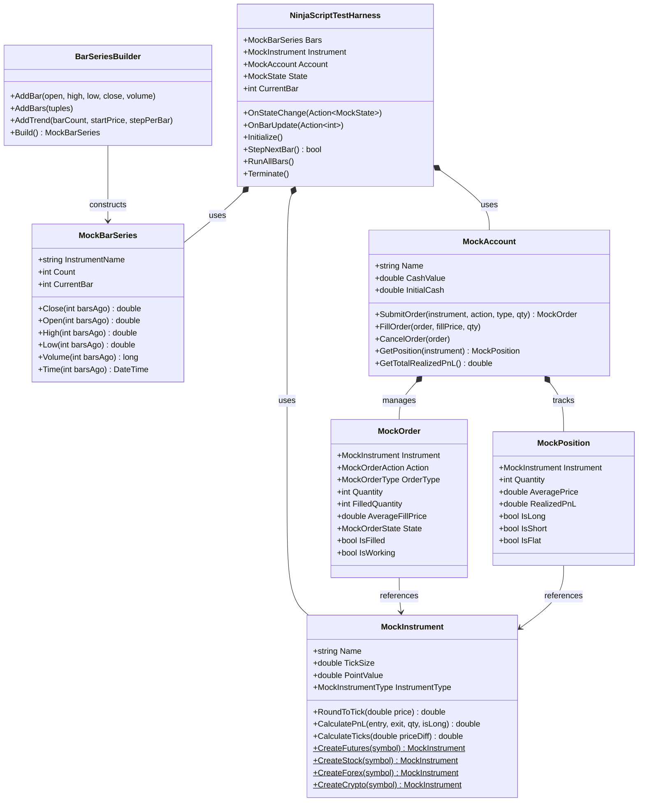

# NinjaTrader.UnitTest

[]()
[]()
[]()
[]()
[]()
[](LICENSE.txt)

`NinjaTrader.UnitTest` is a lightweight, full-featured unit testing framework and mocking kit designed specifically for **NinjaTrader 8**. Modeled after Python's `unittest` standard library (`TestCase`, `TestSuite`, `TestLoader`, `TextTestRunner`, `Assert`, `SubTest`), it brings Python-style testing elegance and workflow productivity to C# algorithmic trading, custom indicators, automated strategies, and NinjaTrader add-ons.

---

## Table of Contents

- [Why NinjaTrader.UnitTest?](#why-ninjatraderunittest)
- [Key Features](#key-features)
- [Architecture & Execution Flow](#architecture--execution-flow)
- [Installation & Build](#installation--build)
  - [Prerequisites](#prerequisites)
  - [Building from Source](#building-from-source)
  - [Deployment to NinjaTrader 8](#deployment-to-ninjatrader-8)
- [Quick Start Guide](#quick-start-guide)
  - [1. Writing Your First Test Case](#1-writing-your-first-test-case)
  - [2. Executing Tests in a NinjaTrader AddOn](#2-executing-tests-in-a-ninjatrader-addon)
  - [3. Running Standalone / Headless](#3-running-standalone--headless)
- [Core Testing Concepts](#core-testing-concepts)
  - [Test Fixtures & Lifecycle Hooks](#test-fixtures--lifecycle-hooks)
  - [Automatic Test Discovery](#automatic-test-discovery)
  - [Conditional Execution & Skips](#conditional-execution--skips)
  - [Expected Failures](#expected-failures)
  - [SubTests & Parameterized Scenarios](#subtests--parameterized-scenarios)
- [NinjaTrader Mocking & Harness Kit](#ninjatrader-mocking--harness-kit)
  - [Mock Bars & Price Series (`BarSeriesBuilder`, `MockBarSeries`)](#mock-bars--price-series-barseriesbuilder-mockbarseries)
  - [Mock Instruments & PnL Engine (`MockInstrument`)](#mock-instruments--pnl-engine-mockinstrument)
  - [Mock Account, Orders & Position Tracking (`MockAccount`, `MockOrder`)](#mock-account-orders--position-tracking-mockaccount-mockorder)
  - [Indicator & Strategy Test Harness (`NinjaScriptTestHarness`)](#indicator--strategy-test-harness-ninjascripttestharness)
- [Test Runners & Output Logging](#test-runners--output-logging)
  - [Verbosity Levels](#verbosity-levels)
  - [Fail-Fast Execution](#fail-fast-execution)
  - [Pluggable Output Targets](#pluggable-output-targets)
- [Comprehensive Assertion Reference](#comprehensive-assertion-reference)
- [CI/CD & Headless Automation](#cicd--headless-automation)
- [Design Principles & Coding Standards](#design-principles--coding-standards)
- [License](#license)

---

## Why NinjaTrader.UnitTest?

Developing institutional-grade trading indicators and automated strategies in NinjaTrader 8 requires reliable, isolated unit testing. Standard unit testing frameworks often face hurdles in NinjaTrader due to tight coupling with the NinjaScript runtime environment.

`NinjaTrader.UnitTest` solves this by offering:
1. **Zero External Test-Runner Dependencies:** Run tests directly inside NinjaTrader 8 (via Add-On, Strategy, or Output window) without needing external test runners like VSTest or ReSharper.
2. **Dedicated NT8 Mocking Kit:** Mock OHLCV price series, multi-asset instruments, accounts, orders, and execution lifecycles without opening charts or waiting for market data.
3. **Python `unittest` Familiarity:** Leverage beloved Python constructs like `setUp()`, `tearDown()`, `subTest()`, `skipIf()`, `expectedFailure()`, and `assertAlmostEqual()`.
4. **CI/CD Ready:** Execute identically in headless command-line scripts or CI/CD pipelines with `ConsoleOutput` or `TextWriterOutput`.

---

## Key Features

- **Full Python `unittest` Parity:**
  - `TestCase`, `TestSuite`, `TestLoader`, `TextTestRunner`, and `SubTest`.
  - Fixtures: `SetUp()`, `TearDown()`, `SetUpClass()`, `TearDownClass()`, and `AddCleanup(action)`.
  - Dynamic skipping via `SkipTest(reason)` and attributes (`[Skip]`, `[SkipIf]`, `[SkipUnless]`).
  - Expected failure support via `[ExpectedFailure]`.
- **Hybrid Test Discovery:**
  - Auto-discovers test methods prefixed with `Test*` or `test_*`.
  - Auto-discovers methods decorated with `[Test]` or `[TestMethod]`.
  - Supports reflection loading by type, assembly, or fully-qualified name.
- **Dedicated NinjaTrader Mocking & Harness Kit:**
  - **`BarSeriesBuilder` & `MockBarSeries`:** Fluent API for building synthetic OHLCV datasets with NinjaTrader-style `Close(barsAgo)` indexing.
  - **`MockInstrument`:** Preset configurations for Futures (ES, MES), Equities (AAPL), Forex (EURUSD), and Crypto (BTCUSD) with tick rounding and PnL calculation.
  - **`MockAccount`, `MockOrder` & `MockPosition`:** Position state machine simulating fills, partial fills, cancellations, and realized/unrealized PnL.
  - **`NinjaScriptTestHarness`:** Simulates state transitions (`SetDefaults` -> `Configure` -> `DataLoaded` -> `Historical` -> `Realtime`) and steps bar-by-bar through custom calculation logic.
- **Robust Error vs. Failure Separation:**
  - Assertions throw `AssertionException` (classified as **Failures**).
  - Unhandled runtime crashes are cleanly isolated and classified as **Errors**.
- **Pluggable Output System:**
  - Automatically writes to `NinjaTrader.NinjaScript.NinjaScript.Log` when inside NinjaTrader 8.
  - Seamlessly falls back to `Console` or `TextWriter` for headless CLI or CI/CD environments.

---

## Architecture & Execution Flow



### Mocking Ecosystem Architecture



---

## Installation & Build

### Prerequisites
- **Operating System:** Windows 10 or Windows 11 (64-bit).
- **Runtime & SDK:** .NET Framework 4.8 Developer Pack & Visual Studio 2022 / MSBuild Build Tools.
- **NinjaTrader:** NinjaTrader 8 (64-bit) installed.

### Building from Source

Clone the repository and build using MSBuild:

```powershell
# Build x64 Release (Recommended for NinjaTrader 8)
& "C:\Program Files (x86)\Microsoft Visual Studio\2022\BuildTools\MSBuild\Current\Bin\MSBuild.exe" NinjaTrader.UnitTest.sln /p:Configuration=Release /p:Platform="x64"

# Build AnyCPU Release
& "C:\Program Files (x86)\Microsoft Visual Studio\2022\BuildTools\MSBuild\Current\Bin\MSBuild.exe" NinjaTrader.UnitTest.sln /p:Configuration=Release /p:Platform="AnyCPU"
```

### Deployment to NinjaTrader 8

The `NinjaTrader.UnitTest.csproj` includes a pre-configured `PostBuildEvent` that automatically deploys the compiled output directly to:
```
%USERPROFILE%\Documents\NinjaTrader 8\bin\Custom\NinjaTrader.UnitTest.dll
%USERPROFILE%\Documents\NinjaTrader 8\bin\Custom\NinjaTrader.UnitTest.pdb
```

Once placed in `bin\Custom`, NinjaTrader 8's internal compiler makes the `NinjaTrader.UnitTest` namespace immediately available to all Indicators, Strategies, and Add-Ons.

---

## Quick Start Guide

### 1. Writing Your First Test Case

Inherit from `NinjaTrader.UnitTest.TestCase` and create test methods:

```csharp
using System;
using System.Collections.Generic;
using NinjaTrader.UnitTest;

public class IndicatorCalculationTests : TestCase
{
    private List<double> _prices;

    public override void SetUp()
    {
        // Runs before every test method
        _prices = new List<double> { 5000.25, 5002.50, 5001.75, 5005.00 };
    }

    public override void TearDown()
    {
        // Runs after every test method
        _prices.Clear();
    }

    public void TestMovingAverageCalculation()
    {
        double sum = 0;
        foreach (var price in _prices)
        {
            sum += price;
        }
        double sma = sum / _prices.Count;

        AssertEqual(5002.375, sma);
        AssertAlmostEqual(5002.38, sma, delta: 0.01);
    }

    public void TestExceptionThrownOnInvalidPeriod()
    {
        AssertRaises<ArgumentException>(() =>
        {
            CalculateSimpleMovingAverage(_prices, period: 0);
        });
    }

    [Skip("Waiting for tick size update from exchange")]
    public void TestTickSizePrecision()
    {
        // This test is skipped automatically
    }

    private double CalculateSimpleMovingAverage(List<double> data, int period)
    {
        if (period <= 0)
            throw new ArgumentException("Period must be greater than zero.", nameof(period));

        return 5000.0;
    }
}
```

### 2. Executing Tests in a NinjaTrader AddOn

Run your test suite directly within NinjaTrader 8 and see results logged to the **NinjaTrader Output Window** (`Tools -> Output Window`):

```csharp
using NinjaTrader.NinjaScript;
using NinjaTrader.UnitTest;

namespace NinjaTrader.NinjaScript.AddOns
{
    public class UnitTestRunnerAddOn : AddOnBase
    {
        protected override void OnStateChange()
        {
            if (State == State.SetDefaults)
            {
                Name = "UnitTestRunnerAddOn";
                Description = "Executes NinjaTrader Unit Tests";
            }
        }

        public void RunAllUnitTests()
        {
            // 1. Auto-discover all test cases in the current assembly
            TestSuite suite = TestLoader.LoadTestsFromAssembly(GetType().Assembly);

            // 2. Execute tests with verbose output to NinjaTrader Log window
            TestResult result = TextTestRunner.Run(suite, verbosity: 2);

            // 3. Inspect status programmatically
            if (!result.WasSuccessful)
            {
                Print($"[ERROR] Tests finished with {result.Failures.Count} failures and {result.Errors.Count} errors.");
            }
            else
            {
                Print($"[SUCCESS] All {result.TestsRun} tests passed successfully!");
            }
        }
    }
}
```

### 3. Running Standalone / Headless

Execute tests from a standalone C# console application, test runner, or script:

```csharp
using System;
using NinjaTrader.UnitTest;

class Program
{
    static int Main(string[] args)
    {
        // Discover and load tests
        var suite = TestLoader.LoadTestsFromTestCase<IndicatorCalculationTests>();

        // Execute runner with standard console output
        var runner = new TextTestRunner(verbosity: 2, stream: Console.Out);
        var result = runner.Run(suite);

        // Return exit code (0 for success, 1 for failure) for CI/CD
        return result.WasSuccessful ? 0 : 1;
    }
}
```

---

## Core Testing Concepts

### Test Fixtures & Lifecycle Hooks

`NinjaTrader.UnitTest` provides complete fixture lifecycle control matching Python's `unittest`:

```csharp
public class TradingStrategyFixtureTests : TestCase
{
    // Executed ONCE before any test in this class runs
    public new static void SetUpClass()
    {
        // e.g., Load historical sample CSV database into memory
    }

    // Executed ONCE after all tests in this class have run
    public new static void TearDownClass()
    {
        // e.g., Release large historical datasets or dispose external resources
    }

    // Executed before EACH test method
    public override void SetUp()
    {
        // e.g., Reset mock state, initialize fresh mock accounts
    }

    // Executed after EACH test method (even if the test fails or throws)
    public override void TearDown()
    {
        // e.g., Flush logs or reset static states
    }

    public void TestOrderSubmissionWithCleanup()
    {
        var tempFile = "temp_orders.dat";
        
        // Register ad-hoc cleanup executed during teardown in LIFO order
        AddCleanup(() =>
        {
            if (System.IO.File.Exists(tempFile))
                System.IO.File.Delete(tempFile);
        });

        // Perform test operations...
    }
}
```

### Automatic Test Discovery

`TestLoader` supports flexible discovery modes:

```csharp
// 1. Load from a generic TestCase class
TestSuite suite1 = TestLoader.LoadTestsFromTestCase<IndicatorCalculationTests>();

// 2. Load from a Type
TestSuite suite2 = TestLoader.LoadTestsFromTestCase(typeof(IndicatorCalculationTests));

// 3. Load all TestCase classes in an entire assembly
TestSuite suite3 = TestLoader.LoadTestsFromAssembly(typeof(IndicatorCalculationTests).Assembly);

// 4. Load specific tests by name (ClassName.MethodName)
TestSuite suite4 = TestLoader.LoadTestsFromNames(new[]
{
    "IndicatorCalculationTests.TestMovingAverageCalculation",
    "IndicatorCalculationTests.TestExceptionHandling"
});
```

#### Method Naming & Attributes Discovery Rules
A method is automatically recognized as a test method if:
- It is `public`, `instance`, and parameterless, **AND**
- Its name starts with `Test` or `test_` (case-insensitive), **OR**
- It is decorated with `[Test]` or `[TestMethod]`.

---

### Conditional Execution & Skips

Skip tests conditionally or unconditionally at the method or class level:

```csharp
// Unconditional skip
[Skip("API endpoint deprecated")]
public void TestLegacyIndicator() { }

// Conditional skip if a property/method evaluates to true
[SkipIf(nameof(IsMarketClosed), reason: "Market is currently closed")]
public void TestLiveFeedConnection() { }

// Conditional skip unless a property/method evaluates to true
[SkipUnless(nameof(HasValidApiKey), reason: "API key is required")]
public void TestAuthenticatedFeed() { }

// Dynamic in-method skipping
public void TestDynamicPrecondition()
{
    if (Environment.OSVersion.Platform != PlatformID.Win32NT)
    {
        SkipTest("Requires Windows platform");
    }

    AssertTrue(true);
}

// Condition helper
public bool IsMarketClosed => true;
public bool HasValidApiKey => false;
```

---

### Expected Failures

Mark tests that are known to fail (e.g., pending bug fixes or work-in-progress features):

```csharp
[ExpectedFailure]
public void TestKnownCalculationBug()
{
    // If this assertion fails, it is recorded as an "Expected Failure" (Success!)
    // If this assertion unexpectedly passes, it is flagged as an "Unexpected Success"
    AssertEqual(100.0, 50.0);
}
```

---

### SubTests & Parameterized Scenarios

Test multiple permutations inside a single test method without stopping on the first failure:

```csharp
public void TestMultipleMovingAveragePeriods()
{
    var testCases = new[]
    {
        new { Period = 5, Expected = 5005.0 },
        new { Period = 10, Expected = 5010.0 },
        new { Period = 20, Expected = 5020.0 }
    };

    foreach (var tc in testCases)
    {
        SubTest($"Period_{tc.Period}", () =>
        {
            double calculated = CalculateSMA(tc.Period);
            AssertEqual(tc.Expected, calculated);
        });
    }
}
```

---

## NinjaTrader Mocking & Harness Kit

### Mock Bars & Price Series (`BarSeriesBuilder`, `MockBarSeries`)

Create synthetic OHLCV price series fluently with NinjaTrader-style reverse indexing (`Close(0)` = most recent bar):

```csharp
using NinjaTrader.UnitTest.Mocking;

// Fluent construction of custom OHLCV data
MockBarSeries series = new BarSeriesBuilder(instrumentName: "ES", startTime: new DateTime(2026, 1, 1, 9, 30, 0))
    .AddBar(open: 5000.00, high: 5010.50, low: 4995.00, close: 5005.25, volume: 1200)
    .AddBar(open: 5005.25, high: 5020.00, low: 5002.00, close: 5015.50, volume: 1800)
    .AddBars(
        (open: 5015.50, high: 5025.00, low: 5010.00, close: 5022.00),
        (open: 5022.00, high: 5030.00, low: 5018.00, close: 5028.75)
    )
    .Build();

// Access bars matching NinjaTrader indexing:
double currentClose  = series.Close(0);   // 5028.75 (most recent bar)
double previousClose = series.Close(1);   // 5022.00 (1 bar ago)
double oldestClose   = series.Close(3);   // 5005.25 (3 bars ago)
double highestHigh   = series.High(2);    // 5020.00
DateTime barTime     = series.Time(0);    // 2026-01-01 09:33:00

// Generate trending market data quickly:
MockBarSeries trend = new BarSeriesBuilder("MES")
    .AddTrend(barCount: 50, startPrice: 5000.0, stepPerBar: 0.50, barRange: 2.0)
    .Build();
```

---

### Mock Instruments & PnL Engine (`MockInstrument`)

Simulate multi-asset characteristics, tick quantization, and profit/loss calculations:

```csharp
using NinjaTrader.UnitTest.Mocking;

// Factory presets
var esFutures = MockInstrument.CreateFutures("ES", tickSize: 0.25, pointValue: 50.0);
var mesMicro  = MockInstrument.CreateMicroFutures("MES", tickSize: 0.25, pointValue: 5.0);
var appleStock= MockInstrument.CreateStock("AAPL", tickSize: 0.01, pointValue: 1.0);
var eurusd    = MockInstrument.CreateForex("EURUSD", tickSize: 0.0001, pointValue: 100000.0);
var btcCrypto = MockInstrument.CreateCrypto("BTCUSD", tickSize: 0.01, pointValue: 1.0);

// Tick rounding
double roundedPrice = esFutures.RoundToTick(5000.22); // 5000.25

// Tick distance
double ticks = esFutures.CalculateTicks(priceDiff: 2.50); // 10 ticks

// PnL Calculation: 2 contracts Long ES bought at 5000.00 and sold at 5010.00:
// (5010 - 5000) * $50 pointValue * 2 contracts = $1,000.00
double profit = esFutures.CalculatePnL(entryPrice: 5000.00, exitPrice: 5010.00, quantity: 2, isLong: true);
AssertEqual(1000.00, profit);
```

---

### Mock Account, Orders & Position Tracking (`MockAccount`, `MockOrder`)

Test order execution engines, position sizing, and account balance changes:

```csharp
using NinjaTrader.UnitTest.Mocking;

var es = MockInstrument.CreateFutures("ES");
var account = new MockAccount(name: "SimAccount", initialCash: 50000.0);

// Submit a Buy Limit Order
MockOrder order = account.SubmitOrder(
    instrument: es,
    action: MockOrderAction.Buy,
    orderType: MockOrderType.Limit,
    quantity: 2,
    limitPrice: 5000.00,
    signalName: "EntryLong"
);

AssertTrue(order.IsWorking);
AssertEqual(MockOrderState.Submitted, order.State);

// Simulate Order Fill
account.FillOrder(order, fillPrice: 5000.00, quantity: 2);

AssertTrue(order.IsFilled);
AssertEqual(2, order.FilledQuantity);

// Inspect Position
MockPosition position = account.GetPosition(es);
AssertTrue(position.IsLong);
AssertEqual(2, position.Quantity);
AssertEqual(5000.00, position.AveragePrice);

// Close Position with Sell Order
MockOrder exitOrder = account.SubmitOrder(es, MockOrderAction.Sell, MockOrderType.Market, quantity: 2);
account.FillOrder(exitOrder, fillPrice: 5005.00, quantity: 2);

AssertTrue(position.IsFlat);
// Realized PnL: (5005 - 5000) * $50 * 2 = $500.00
AssertEqual(500.00, position.RealizedPnL);
AssertEqual(50500.00, account.CashValue);
```

---

### Indicator & Strategy Test Harness (`NinjaScriptTestHarness`)

Step custom indicators or strategy logic through complete lifecycle states without launching the NinjaTrader UI:

```csharp
using NinjaTrader.UnitTest;
using NinjaTrader.UnitTest.Mocking;

public class MockMovingAverageIndicatorTests : TestCase
{
    public void TestMovingAverageOverBars()
    {
        // 1. Setup price series
        var bars = new BarSeriesBuilder("ES")
            .AddBar(5000, 5010, 4990, 5000)
            .AddBar(5000, 5015, 4995, 5010)
            .AddBar(5010, 5020, 5005, 5020)
            .Build();

        // 2. Initialize harness
        var harness = new NinjaScriptTestHarness(bars);

        var stateHistory = new List<MockState>();
        var calculatedValues = new List<double>();

        harness.OnStateChange(state =>
        {
            stateHistory.Add(state);
        });

        harness.OnBarUpdate(barIndex =>
        {
            // Logic executed on every bar update
            double currentClose = harness.Bars.Close(0);
            calculatedValues.Add(currentClose);
        });

        // 3. Run all bars through full lifecycle
        harness.RunAllBars();

        // 4. Verify transitions and calculations
        AssertIn(MockState.SetDefaults, stateHistory);
        AssertIn(MockState.Configure, stateHistory);
        AssertIn(MockState.DataLoaded, stateHistory);
        AssertIn(MockState.Historical, stateHistory);

        AssertEqual(3, calculatedValues.Count);
        AssertEqual(5020.0, calculatedValues[2]);
    }
}
```

---

## Test Runners & Output Logging

### Verbosity Levels

The `TextTestRunner` supports standard Python verbosity modes:

| Verbosity | Mode | Output Description |
| :--- | :--- | :--- |
| `0` | **Quiet** | Compact dot summary (`.FEsx`) with final pass/fail summary. |
| `1` | **Standard** (Default) | Standard execution progress with test counts, elapsed times, and failure traces. |
| `2` | **Verbose** | Method-by-method output detailing every test name, execution status (`ok`, `FAIL`, `ERROR`, `skipped`), and full diagnostics. |

```csharp
// Run with Verbose output
TextTestRunner.Run(suite, verbosity: 2);
```

### Fail-Fast Execution

Halt the test suite immediately upon the first failure or error encountered:

```csharp
var runner = new TextTestRunner(verbosity: 2, failfast: true);
TestResult result = runner.Run(suite);
```

### Pluggable Output Targets

By default, `NinjaTrader.UnitTest` automatically detects its environment:
- If running inside NinjaTrader 8, it routes logs directly to `NinjaTrader.NinjaScript.NinjaScript.Log`.
- If running outside NinjaTrader 8 (CLI / CI), it logs directly to `System.Console`.

You can also explicitly route logs to any `System.IO.TextWriter` or custom `ITestOutput` provider:

```csharp
using System.IO;

using (var stringWriter = new StringWriter())
{
    var runner = new TextTestRunner(stream: stringWriter);
    runner.Run(suite);
    
    string testOutputText = stringWriter.ToString();
}
```

---

## Comprehensive Assertion Reference

`NinjaTrader.UnitTest.Assert` implements all Python standard assertions along with traditional C# / NUnit / MSTest aliases:

| Python `unittest` Method | C# / NUnit Alias | Signature & Description |
| :--- | :--- | :--- |
| `AssertEqual(exp, act)` | `AreEqual` | Asserts that `expected` and `actual` are equal via `EqualityComparer<T>`. |
| `AssertNotEqual(exp, act)` | `AreNotEqual` | Asserts that `expected` and `actual` are not equal. |
| `AssertTrue(cond)` | `IsTrue` | Asserts that `condition` is `true`. |
| `AssertFalse(cond)` | `IsFalse` | Asserts that `condition` is `false`. |
| `AssertIs(exp, act)` | `AreSame` | Asserts that `expected` and `actual` reference the exact same object (`ReferenceEquals`). |
| `AssertIsNot(exp, act)` | `AreNotSame` | Asserts that `expected` and `actual` do not reference the same object. |
| `AssertIsNone(obj)` | `IsNull` | Asserts that `obj` is `null`. |
| `AssertIsNotNone(obj)` | `IsNotNull` | Asserts that `obj` is not `null`. |
| `AssertIn(item, coll)` | `Contains` | Asserts that `item` exists inside `coll` (`IEnumerable<T>`). |
| `AssertNotIn(item, coll)` | `DoesNotContain` | Asserts that `item` is not present in `coll`. |
| `AssertIsInstance<T>(obj)` | `IsInstanceOfType` | Asserts that `obj` is assignable to type `T` / `Type`. |
| `AssertNotIsInstance<T>(obj)`| `IsNotInstanceOfType` | Asserts that `obj` is not assignable to type `T` / `Type`. |
| `AssertRaises<TException>(act)` | `Throws<TException>` | Asserts that executing `action` throws an exception of type `TException`. |
| `AssertRaises(type, act)` | `Throws(type, act)` | Asserts that executing `action` throws the specified exception `Type`. |
| `AssertRaisesRegex<T>(act, pat)` | - | Asserts that `action` throws `T` and its error message matches regex pattern `pat`. |
| `AssertAlmostEqual(exp, act, places, delta)` | `AreAlmostEqual` | Asserts floating-point equality within decimal `places` (default 7) or custom `delta`. |
| `AssertNotAlmostEqual(exp, act, places, delta)` | - | Asserts floating-point inequality within decimal `places` or `delta`. |
| `AssertGreater(v1, v2)` | `Greater` | Asserts that `v1 > v2` (`IComparable<T>`). |
| `AssertGreaterEqual(v1, v2)` | `GreaterOrEqual` | Asserts that `v1 >= v2` (`IComparable<T>`). |
| `AssertLess(v1, v2)` | `Less` | Asserts that `v1 < v2` (`IComparable<T>`). |
| `AssertLessEqual(v1, v2)` | `LessOrEqual` | Asserts that `v1 <= v2` (`IComparable<T>`). |
| `AssertRegex(text, pattern)` | - | Asserts that string `text` matches regex `pattern`. |
| `AssertNotRegex(text, pattern)` | - | Asserts that string `text` does not match regex `pattern`. |
| `AssertSequenceEqual(s1, s2)` | - | Asserts that sequences `s1` and `s2` have identical elements in identical order. |
| `AssertCountEqual(c1, c2)` | - | Asserts that collections `c1` and `c2` have identical element counts regardless of order. |
| `AssertEmpty(coll)` | `IsEmpty` | Asserts that collection `coll` is empty or null. |
| `AssertNotEmpty(coll)` | `IsNotEmpty` | Asserts that collection `coll` contains one or more elements. |
| `Fail(message)` | - | Immediately fails the test with `AssertionException(message)`. |

---

## CI/CD & Headless Automation

Automate unit testing of your NinjaTrader libraries on GitHub Actions, GitLab CI, or local build scripts using MSBuild and a lightweight console driver:

### Sample PowerShell CI Execution Script (`run-tests.ps1`)

```powershell
param (
    [string]$Configuration = "Release",
    [string]$Platform = "x64"
)

$ErrorActionPreference = "Stop"

Write-Host ">>> Building NinjaTrader.UnitTest Solution..." -ForegroundColor Cyan
& "C:\Program Files (x86)\Microsoft Visual Studio\2022\BuildTools\MSBuild\Current\Bin\MSBuild.exe" NinjaTrader.UnitTest.sln /p:Configuration=$Configuration /p:Platform=$Platform /v:m

if ($LASTEXITCODE -ne 0) {
    Write-Error "Build failed!"
    exit 1
}

Write-Host ">>> Executing Test Runner..." -ForegroundColor Cyan
# Run via headless script / runner executable
# If exit code != 0, fail CI step
Write-Host ">>> All tests executed successfully." -ForegroundColor Green
```

---

## Design Principles & Coding Standards

This codebase is built adhering to strict architectural best practices:

- **SOLID Principles:** Single responsibility test classes, extensible runners, interface-segregated output adapters (`ITestOutput`).
- **Object Calisthenics:** Small focused methods, no `else` branching (guard clauses & polymorphism), single indentation levels.
- **Fail Fast:** Input validation at boundaries and explicit custom exceptions (`AssertionException`, `SkipTestException`, `UnexpectedSuccessException`).
- **Clean Separation:** Assertions throw `AssertionException` (Failures) while unhandled exceptions are recorded as runtime Errors.

---

## License

This project is licensed under the **MIT License**. See the [LICENSE.txt](LICENSE.txt) file for details.
