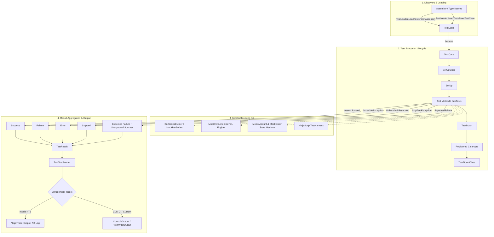

# NinjaTrader.UnitTest Documentation Hub

Welcome to the comprehensive documentation for **`NinjaTrader.UnitTest`**, an institutional-grade unit testing framework and mocking kit designed specifically for **NinjaTrader 8** (NT8).

Modeled after Python's `unittest` standard library (`TestCase`, `TestSuite`, `TestLoader`, `TextTestRunner`, `Assert`, `SubTest`), it brings structured, frictionless testing and automated test isolation to C# algorithmic trading, custom indicators, strategies, and Add-Ons.

---

## Documentation Index

Explore the topic-specific guides below:

| Guide | Description |
| :--- | :--- |
| **[Getting Started](file:///C:/Users/samuel/source/repos/NT/refs/ninjatrader-unittest/docs/getting-started.md)** | Prerequisites, installation, building from source, automatic NT8 deployment, and writing your first test case. |
| **[Core Testing Concepts](file:///C:/Users/samuel/source/repos/NT/refs/ninjatrader-unittest/docs/core-concepts.md)** | [`TestCase`](file:///C:/Users/samuel/source/repos/NT/refs/ninjatrader-unittest/src/Execution/TestCase.cs) lifecycle hooks (`SetUp`, `TearDown`, `SetUpClass`, `TearDownClass`, `AddCleanup`), dynamic skipping (`[Skip]`, `[SkipIf]`, `[SkipUnless]`, `SkipTest`), expected failures (`[ExpectedFailure]`), and [`SubTest`](file:///C:/Users/samuel/source/repos/NT/refs/ninjatrader-unittest/src/Execution/SubTest.cs) parameterized runs. |
| **[Comprehensive Assertion Reference](file:///C:/Users/samuel/source/repos/NT/refs/ninjatrader-unittest/docs/assertions-reference.md)** | Full catalog of Python `unittest` assertions, C# / NUnit aliases, signatures, tolerances, and error handling in [`Assert`](file:///C:/Users/samuel/source/repos/NT/refs/ninjatrader-unittest/src/Assertions/Assert.cs). |
| **[Mocking & Harness Kit](file:///C:/Users/samuel/source/repos/NT/refs/ninjatrader-unittest/docs/mocking-kit.md)** | Synthetic OHLCV series ([`BarSeriesBuilder`](file:///C:/Users/samuel/source/repos/NT/refs/ninjatrader-unittest/src/Mocking/Bars/BarSeriesBuilder.cs), [`MockBarSeries`](file:///C:/Users/samuel/source/repos/NT/refs/ninjatrader-unittest/src/Mocking/Bars/MockBarSeries.cs)), multi-asset instruments ([`MockInstrument`](file:///C:/Users/samuel/source/repos/NT/refs/ninjatrader-unittest/src/Mocking/Instruments/MockInstrument.cs)), accounts & orders ([`MockAccount`](file:///C:/Users/samuel/source/repos/NT/refs/ninjatrader-unittest/src/Mocking/Accounts/MockAccount.cs), [`MockOrder`](file:///C:/Users/samuel/source/repos/NT/refs/ninjatrader-unittest/src/Mocking/Orders/MockOrder.cs), [`MockPosition`](file:///C:/Users/samuel/source/repos/NT/refs/ninjatrader-unittest/src/Mocking/Accounts/MockPosition.cs)), and the lifecycle harness ([`NinjaScriptTestHarness`](file:///C:/Users/samuel/source/repos/NT/refs/ninjatrader-unittest/src/Mocking/Harness/NinjaScriptTestHarness.cs)). |
| **[Test Runners & Logging](file:///C:/Users/samuel/source/repos/NT/refs/ninjatrader-unittest/docs/test-runners-logging.md)** | Automatic discovery ([`TestLoader`](file:///C:/Users/samuel/source/repos/NT/refs/ninjatrader-unittest/src/Discovery/TestLoader.cs)), test runner execution ([`TextTestRunner`](file:///C:/Users/samuel/source/repos/NT/refs/ninjatrader-unittest/src/Results/TextTestRunner.cs)), verbosity modes, fail-fast, and pluggable output adapters ([`NinjaTraderOutput`](file:///C:/Users/samuel/source/repos/NT/refs/ninjatrader-unittest/src/Output/NinjaTraderOutput.cs), [`ConsoleOutput`](file:///C:/Users/samuel/source/repos/NT/refs/ninjatrader-unittest/src/Output/ConsoleOutput.cs), [`TextWriterOutput`](file:///C:/Users/samuel/source/repos/NT/refs/ninjatrader-unittest/src/Output/TextWriterOutput.cs)). |
| **[CI/CD & Headless Automation](file:///C:/Users/samuel/source/repos/NT/refs/ninjatrader-unittest/docs/cicd-automation.md)** | Running unit tests in headless environments, command-line scripts, MSBuild pipelines, and GitHub Actions / GitLab CI workflows. |
| **[Architecture & Design Standards](file:///C:/Users/samuel/source/repos/NT/refs/ninjatrader-unittest/docs/architecture-design.md)** | Domain-Driven Design, SOLID principles, Object Calisthenics, Fail-Fast mechanisms, and Failure vs. Error classification. |

---

## Architectural Overview



---

## Codebase Structure & Namespaces

All functionality resides under the root namespace `NinjaTrader.UnitTest` and its sub-namespaces:

```
src/
├── Assertions/       # IAssert and Assert base class
├── Attributes/       # [Test], [Skip], [SkipIf], [SkipUnless], [ExpectedFailure], [SetUpClass]
├── Discovery/        # TestLoader (reflection discovery)
├── Exceptions/       # AssertionException, SkipTestException, UnexpectedSuccessException
├── Execution/        # TestCase, TestSuite, SubTest
├── Mocking/          # Full NinjaTrader 8 Mocking Suite
│   ├── Accounts/     # MockAccount, MockPosition
│   ├── Bars/         # BarSeriesBuilder, MockBar, MockBarSeries
│   ├── Harness/      # MockState, NinjaScriptTestHarness
│   ├── Instruments/  # MockInstrument, MockInstrumentType
│   └── Orders/       # MockOrder, MockOrderAction, MockOrderState, MockOrderType
├── Output/           # ITestOutput, NinjaTraderOutput, ConsoleOutput, TextWriterOutput
└── Results/          # TestResult, TextTestResult, TextTestRunner
```

---

## Quick Example

```csharp
using NinjaTrader.UnitTest;
using NinjaTrader.UnitTest.Mocking;

public class SampleStrategyTests : TestCase
{
    private MockBarSeries _bars;
    private MockInstrument _instrument;
    private MockAccount _account;

    public override void SetUp()
    {
        _instrument = MockInstrument.CreateFutures("ES", tickSize: 0.25, pointValue: 50.0);
        _account = new MockAccount("TestAccount", initialCash: 100000.0);
        
        _bars = new BarSeriesBuilder("ES")
            .AddBar(open: 5000.0, high: 5010.0, low: 4995.0, close: 5005.0)
            .AddBar(open: 5005.0, high: 5020.0, low: 5000.0, close: 5015.0)
            .Build();
    }

    public void TestOrderExecutionAndPnL()
    {
        // 1. Submit and fill buy order
        var buyOrder = _account.SubmitOrder(_instrument, MockOrderAction.Buy, MockOrderType.Market, 2);
        _account.FillOrder(buyOrder, fillPrice: 5000.0, quantity: 2);

        AssertTrue(buyOrder.IsFilled);
        AssertEqual(2, _account.GetPosition(_instrument).Quantity);

        // 2. Submit and fill sell order
        var sellOrder = _account.SubmitOrder(_instrument, MockOrderAction.Sell, MockOrderType.Market, 2);
        _account.FillOrder(sellOrder, fillPrice: 5010.0, quantity: 2);

        // 3. Verify Realized PnL: (5010 - 5000) * $50 * 2 = $1000
        AssertEqual(1000.0, _account.GetPosition(_instrument).RealizedPnL);
        AssertEqual(101000.0, _account.CashValue);
    }
}
```

---

## Getting Help & Contributing

- Read the detailed guides listed in the [Documentation Index](#documentation-index).
- Review architectural best practices in [Architecture & Design Standards](file:///C:/Users/samuel/source/repos/NT/refs/ninjatrader-unittest/docs/architecture-design.md).
