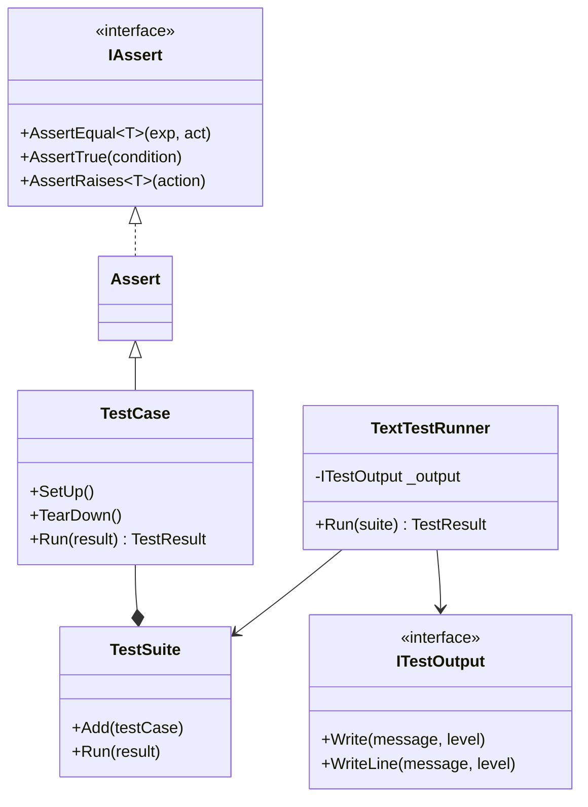
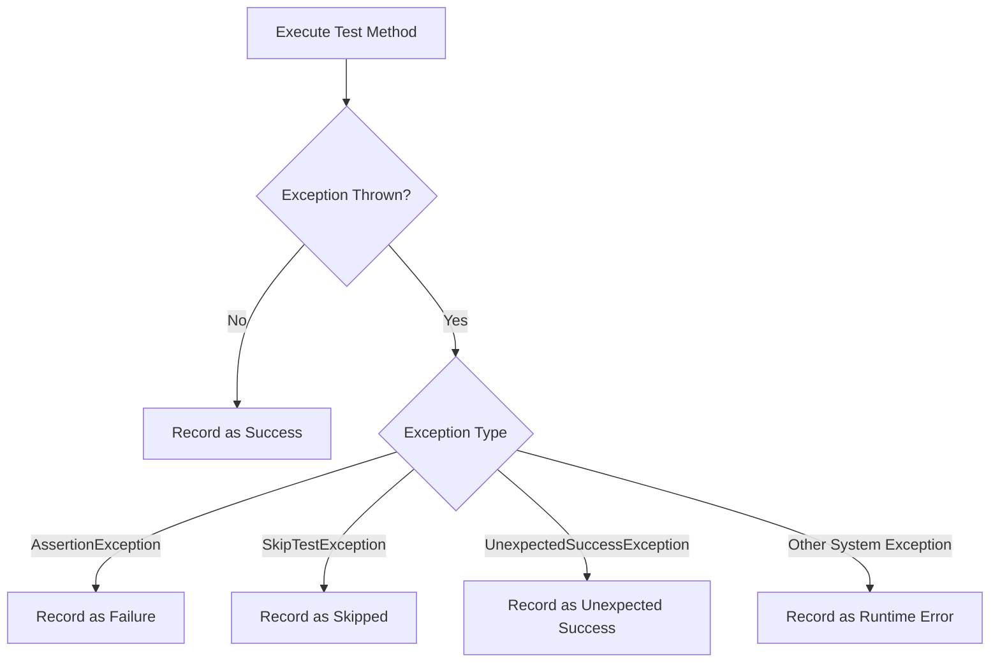

# Architecture & Design Standards

`NinjaTrader.UnitTest` is designed from the ground up adhering to Domain-Driven Design (DDD), SOLID principles, Object Calisthenics, and strict Fail-Fast architectural patterns.

---

## 1. Design Philosophy

Developing trading algorithms in NinjaTrader 8 requires high execution confidence and deterministic state verification. `NinjaTrader.UnitTest` delivers this through:
- **Zero External Test-Runner Coupling:** Eliminates external Visual Studio or ReSharper test runner dependencies inside the NinjaTrader environment.
- **Python `unittest` Familiarity:** Implements standard test semantics (`TestCase`, `TestSuite`, `TestLoader`, `TextTestRunner`, `SubTest`, `Assert`).
- **Purity & Isolation:** Replaces live chart feeds with synthetic price series ([`MockBarSeries`](file:///C:/Users/samuel/source/repos/NT/refs/ninjatrader-unittest/src/Mocking/Bars/MockBarSeries.cs)) and isolated execution harnesses ([`NinjaScriptTestHarness`](file:///C:/Users/samuel/source/repos/NT/refs/ninjatrader-unittest/src/Mocking/Harness/NinjaScriptTestHarness.cs)).

---

## 2. SOLID Principles Adherence

- **Single Responsibility Principle (SRP):**
  - [`TestLoader`](file:///C:/Users/samuel/source/repos/NT/refs/ninjatrader-unittest/src/Discovery/TestLoader.cs) handles test discovery via reflection only.
  - [`TestCase`](file:///C:/Users/samuel/source/repos/NT/refs/ninjatrader-unittest/src/Execution/TestCase.cs) manages single-test execution and lifecycle hooks.
  - [`TestSuite`](file:///C:/Users/samuel/source/repos/NT/refs/ninjatrader-unittest/src/Execution/TestSuite.cs) aggregates and sequences tests.
  - [`TestResult`](file:///C:/Users/samuel/source/repos/NT/refs/ninjatrader-unittest/src/Results/TestResult.cs) accumulates counts, durations, and diagnostic traces.
  - [`TextTestRunner`](file:///C:/Users/samuel/source/repos/NT/refs/ninjatrader-unittest/src/Results/TextTestRunner.cs) formats output and coordinates overall suite execution.
- **Open/Closed Principle (OCP):**
  - Logging is extensible via [`ITestOutput`](file:///C:/Users/samuel/source/repos/NT/refs/ninjatrader-unittest/src/Output/Abstractions/ITestOutput.cs) without modifying test runner code.
  - New assertions can be added to [`IAssert`](file:///C:/Users/samuel/source/repos/NT/refs/ninjatrader-unittest/src/Assertions/IAssert.cs) / [`Assert`](file:///C:/Users/samuel/source/repos/NT/refs/ninjatrader-unittest/src/Assertions/Assert.cs) without modifying [`TestCase`](file:///C:/Users/samuel/source/repos/NT/refs/ninjatrader-unittest/src/Execution/TestCase.cs).
- **Liskov Substitution Principle (LSP):**
  - Any custom [`TestCase`](file:///C:/Users/samuel/source/repos/NT/refs/ninjatrader-unittest/src/Execution/TestCase.cs) subclass preserves base execution semantics and can be passed to any [`TestSuite`](file:///C:/Users/samuel/source/repos/NT/refs/ninjatrader-unittest/src/Execution/TestSuite.cs).
  - Any [`ITestOutput`](file:///C:/Users/samuel/source/repos/NT/refs/ninjatrader-unittest/src/Output/Abstractions/ITestOutput.cs) implementation ([`NinjaTraderOutput`](file:///C:/Users/samuel/source/repos/NT/refs/ninjatrader-unittest/src/Output/NinjaTraderOutput.cs), [`ConsoleOutput`](file:///C:/Users/samuel/source/repos/NT/refs/ninjatrader-unittest/src/Output/ConsoleOutput.cs), [`TextWriterOutput`](file:///C:/Users/samuel/source/repos/NT/refs/ninjatrader-unittest/src/Output/TextWriterOutput.cs)) can be swapped transparently.
- **Interface Segregation Principle (ISP):**
  - Small, dedicated interfaces: [`IAssert`](file:///C:/Users/samuel/source/repos/NT/refs/ninjatrader-unittest/src/Assertions/IAssert.cs) for assertion contracts and [`ITestOutput`](file:///C:/Users/samuel/source/repos/NT/refs/ninjatrader-unittest/src/Output/Abstractions/ITestOutput.cs) for message dispatching.
- **Dependency Inversion Principle (DIP):**
  - High-level modules like [`TextTestRunner`](file:///C:/Users/samuel/source/repos/NT/refs/ninjatrader-unittest/src/Results/TextTestRunner.cs) depend on abstractions ([`ITestOutput`](file:///C:/Users/samuel/source/repos/NT/refs/ninjatrader-unittest/src/Output/Abstractions/ITestOutput.cs)), not concrete implementations.

---

## 3. Object Calisthenics Rules

The codebase strictly adheres to Object Calisthenics:

1. **One Indentation Level per Method:** Complex loops and condition chains are extracted into focused, descriptive helper methods.
2. **Do Not Use the `else` Keyword:** Control flow uses early returns, guard clauses, and state dispatchers.
3. **Wrap Domain Primitives:** Domain concepts are encapsulated into dedicated types (e.g., [`MockInstrumentType`](file:///C:/Users/samuel/source/repos/NT/refs/ninjatrader-unittest/src/Mocking/Instruments/MockInstrumentType.cs), [`MockOrderAction`](file:///C:/Users/samuel/source/repos/NT/refs/ninjatrader-unittest/src/Mocking/Orders/MockOrderAction.cs), [`MockOrderState`](file:///C:/Users/samuel/source/repos/NT/refs/ninjatrader-unittest/src/Mocking/Orders/MockOrderState.cs), [`MockState`](file:///C:/Users/samuel/source/repos/NT/refs/ninjatrader-unittest/src/Mocking/Harness/MockState.cs)).
4. **First-Class Collections:** Collections with domain operations are wrapped in dedicated types (e.g., [`MockBarSeries`](file:///C:/Users/samuel/source/repos/NT/refs/ninjatrader-unittest/src/Mocking/Bars/MockBarSeries.cs), [`TestSuite`](file:///C:/Users/samuel/source/repos/NT/refs/ninjatrader-unittest/src/Execution/TestSuite.cs)).
5. **One Dot per Line:** Intermediate results are assigned or encapsulated in builder chains.
6. **No Abbreviations:** Variables and classes use explicit, readable names (`BarSeriesBuilder`, not `BarBldr`).
7. **Keep Entities Small:** Methods average <15 lines; classes maintain focused scopes.
8. **Tell, Do Not Ask:** Methods tell objects to perform behavior (e.g., `es.RoundToTick(price)`, `account.FillOrder(...)`) instead of mutating external state directly.

---

## 4. Fail-Fast & Error vs. Failure Separation

`NinjaTrader.UnitTest` enforces clear separation between assertion failures and unhandled runtime exceptions:

### Custom Exception Hierarchy

| Exception | Purpose | Result Classification |
| :--- | :--- | :--- |
| **[`AssertionException`](file:///C:/Users/samuel/source/repos/NT/refs/ninjatrader-unittest/src/Exceptions/AssertionException.cs)** | Thrown when an assertion condition is not satisfied. | **Failure** |
| **[`SkipTestException`](file:///C:/Users/samuel/source/repos/NT/refs/ninjatrader-unittest/src/Exceptions/SkipTestException.cs)** | Thrown when `SkipTest(reason)` or skip attributes are triggered. | **Skipped** |
| **[`UnexpectedSuccessException`](file:///C:/Users/samuel/source/repos/NT/refs/ninjatrader-unittest/src/Exceptions/UnexpectedSuccessException.cs)** | Thrown when a test marked with `[ExpectedFailure]` passes without error. | **Unexpected Success** |
| **`System.Exception`** | Any unexpected runtime null-reference, index out of range, or crash. | **Error** |
