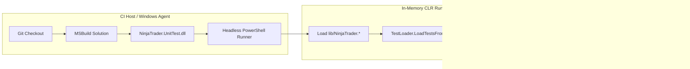

# CI/CD & Headless Automation

`NinjaTrader.UnitTest` enables automated testing of your NinjaTrader indicators, strategies, and shared libraries on continuous integration platforms (e.g., GitHub Actions, GitLab CI, Azure Pipelines) and local command-line build scripts without launching the NinjaTrader 8 desktop application.

---

## Architecture of Headless Execution

Because `NinjaTrader.UnitTest` decouples NinjaScript calculation logic from chart rendering via mock objects ([`MockBarSeries`](file:///C:/Users/samuel/source/repos/NT/refs/ninjatrader-unittest/src/Mocking/Bars/MockBarSeries.cs), [`MockInstrument`](file:///C:/Users/samuel/source/repos/NT/refs/ninjatrader-unittest/src/Mocking/Instruments/MockInstrument.cs), [`MockAccount`](file:///C:/Users/samuel/source/repos/NT/refs/ninjatrader-unittest/src/Mocking/Accounts/MockAccount.cs), [`NinjaScriptTestHarness`](file:///C:/Users/samuel/source/repos/NT/refs/ninjatrader-unittest/src/Mocking/Harness/NinjaScriptTestHarness.cs)), test suites execute entirely within the standard .NET Framework 4.8 CLR.



---

## Automated Test Script (`run-tests.ps1`)

Create or run a PowerShell script at the root of your repository to build and execute all tests headlessly:

```powershell
param (
    [string]$Configuration = "Release",
    [string]$Platform = "x64"
)

$ErrorActionPreference = "Stop"

Write-Host ">>> [1/2] Compiling NinjaTrader.UnitTest Solution ($Configuration|$Platform)..." -ForegroundColor Cyan
& "C:\Program Files (x86)\Microsoft Visual Studio\2022\BuildTools\MSBuild\Current\Bin\MSBuild.exe" NinjaTrader.UnitTest.sln /p:Configuration=$Configuration /p:Platform=$Platform /v:m

if ($LASTEXITCODE -ne 0) {
    Write-Error "Build failed with exit code $LASTEXITCODE"
    exit 1
}

Write-Host ">>> [2/2] Running Unit Test Suite Headlessly..." -ForegroundColor Cyan

# Execute using .NET Framework PowerShell
powershell.exe -NoProfile -ExecutionPolicy Bypass -Command @"
    [System.Reflection.Assembly]::LoadFrom((Resolve-Path 'lib/NinjaTrader.Core.dll').Path) | Out-Null
    [System.Reflection.Assembly]::LoadFrom((Resolve-Path 'lib/NinjaTrader.Gui.dll').Path) | Out-Null
    `$asm = [System.Reflection.Assembly]::LoadFrom((Resolve-Path 'bin/$Platform/$Configuration/NinjaTrader.UnitTest.dll').Path)
    `$suite = [NinjaTrader.UnitTest.TestLoader]::LoadTestsFromAssembly(`$asm)
    `$writer = New-Object System.IO.StringWriter
    `$runner = New-Object NinjaTrader.UnitTest.TextTestRunner(2, `$false, `$writer, `$null)
    `$res = `$runner.Run(`$suite)
    Write-Host `$writer.ToString()
    if (-not `$res.WasSuccessful) { exit 1 }
"@

if ($LASTEXITCODE -ne 0) {
    Write-Error "Test suite finished with failures or errors!"
    exit 1
}

Write-Host ">>> All tests completed successfully." -ForegroundColor Green
```

---

## GitHub Actions CI Workflow

Add the following workflow definition to `.github/workflows/ci.yml`:

```yaml
name: Build & Test NinjaTrader.UnitTest

on:
  push:
    branches: [ master, main ]
  pull_request:
    branches: [ master, main ]

jobs:
  build-and-test:
    runs-on: windows-latest

    steps:
      - name: Checkout Code
        uses: actions/checkout@v4

      - name: Setup MSBuild
        uses: microsoft/setup-msbuild@v2

      - name: Build Solution (x64 Release)
        run: |
          msbuild.exe NinjaTrader.UnitTest.sln /p:Configuration=Release /p:Platform="x64" /v:m

      - name: Run Test Suite Headlessly
        shell: powershell
        run: |
          powershell.exe -NoProfile -ExecutionPolicy Bypass -Command @"
            [System.Reflection.Assembly]::LoadFrom((Resolve-Path 'lib/NinjaTrader.Core.dll').Path) | Out-Null
            [System.Reflection.Assembly]::LoadFrom((Resolve-Path 'lib/NinjaTrader.Gui.dll').Path) | Out-Null
            `$asm = [System.Reflection.Assembly]::LoadFrom((Resolve-Path 'bin/x64/Release/NinjaTrader.UnitTest.dll').Path)
            `$suite = [NinjaTrader.UnitTest.TestLoader]::LoadTestsFromAssembly(`$asm)
            `$writer = New-Object System.IO.StringWriter
            `$runner = New-Object NinjaTrader.UnitTest.TextTestRunner(2, `$false, `$writer, `$null)
            `$res = `$runner.Run(`$suite)
            Write-Host `$writer.ToString()
            if (-not `$res.WasSuccessful) { exit 1 }
          "@
```

---

## Best Practices for Headless Testing

1. **Keep NinjaTrader Binaries in `lib/`:**
   Store reference copies of `NinjaTrader.Core.dll` and `NinjaTrader.Gui.dll` inside the `lib/` directory so CI build agents can resolve assemblies without an installed desktop client.
2. **Never Call UI-Coupled Methods:**
   Avoid invoking WPF or GUI-dependent components in pure unit tests. Use [`NinjaScriptTestHarness`](file:///C:/Users/samuel/source/repos/NT/refs/ninjatrader-unittest/src/Mocking/Harness/NinjaScriptTestHarness.cs) for calculations and lifecycle state progression.
3. **Use Explicit Assertions:**
   Prefer exact equality ([`AssertEqual`](file:///C:/Users/samuel/source/repos/NT/refs/ninjatrader-unittest/src/Assertions/Assert.cs)) or tolerance comparisons ([`AssertAlmostEqual`](file:///C:/Users/samuel/source/repos/NT/refs/ninjatrader-unittest/src/Assertions/Assert.cs)) to make test outputs transparent in CI logs.
