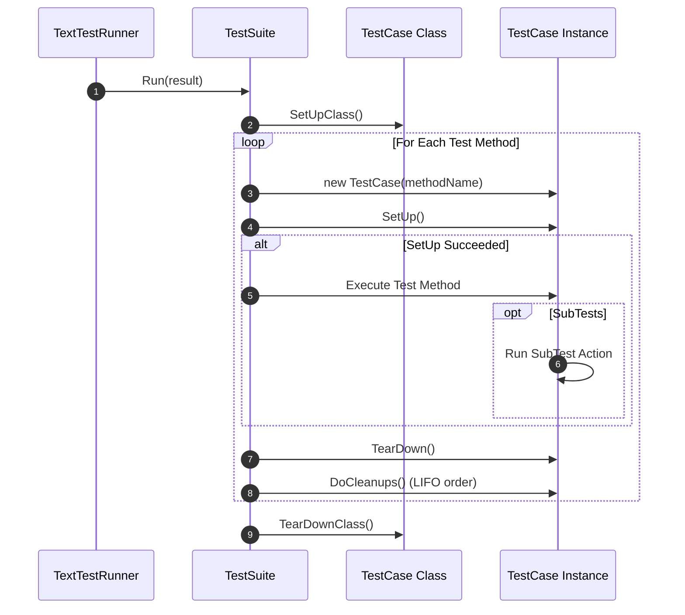

# Core Testing Concepts

`NinjaTrader.UnitTest` models Python's `unittest` paradigm, bringing familiar test lifecycle fixtures, dynamic skipping, expected failure handling, and subtests to C# algorithmic trading development.

---

## The [`TestCase`](file:///C:/Users/samuel/source/repos/NT/refs/ninjatrader-unittest/src/Execution/TestCase.cs) Base Class

All unit tests inherit from [`NinjaTrader.UnitTest.TestCase`](file:///C:/Users/samuel/source/repos/NT/refs/ninjatrader-unittest/src/Execution/TestCase.cs). 

[`TestCase`](file:///C:/Users/samuel/source/repos/NT/refs/ninjatrader-unittest/src/Execution/TestCase.cs) provides:
- Inheritance from [`Assert`](file:///C:/Users/samuel/source/repos/NT/refs/ninjatrader-unittest/src/Assertions/Assert.cs) (direct access to all assertions without typing `Assert.`).
- Pre- and post-test lifecycle hooks (`SetUp`, `TearDown`, `SetUpClass`, `TearDownClass`).
- Ad-hoc cleanup registration (`AddCleanup`).
- Subtest execution (`SubTest`).
- Dynamic skipping (`SkipTest`).

---

## Test Fixtures & Lifecycle Hooks

The test execution lifecycle follows a strict hierarchy guaranteeing resource cleanup:



### 1. Per-Test Fixtures (`SetUp` & `TearDown`)

- **`SetUp()`**: Executed before each individual test method. Use it to instantiate fresh mock objects, reset state, and initialize test data.
- **`TearDown()`**: Executed after each individual test method, **regardless of whether the test passed, failed, or threw an error**.

```csharp
public class OrderBookTests : TestCase
{
    private MockAccount _account;

    public override void SetUp()
    {
        _account = new MockAccount("SimAccount", 50000.0);
    }

    public override void TearDown()
    {
        _account.Orders.Clear();
    }

    public void TestOrderSubmission()
    {
        var instrument = MockInstrument.CreateFutures("ES");
        var order = _account.SubmitOrder(instrument, MockOrderAction.Buy, MockOrderType.Limit, 1, 5000.0);
        AssertEqual(1, _account.Orders.Count);
    }
}
```

### 2. Class-Level Fixtures (`SetUpClass` & `TearDownClass`)

Class fixtures run once for the entire test class rather than per test method:

- **`public new static void SetUpClass()`**: Executed once before any test method in the class.
- **`public new static void TearDownClass()`**: Executed once after all test methods in the class have finished.

```csharp
public class HistoricalDataFixtureTests : TestCase
{
    private static MockBarSeries s_sharedData;

    public new static void SetUpClass()
    {
        // Load large dataset once for all tests in this fixture
        s_sharedData = new BarSeriesBuilder("ES")
            .AddTrend(barCount: 1000, startPrice: 5000.0, stepPerBar: 0.25)
            .Build();
    }

    public new static void TearDownClass()
    {
        s_sharedData = null;
    }

    public void TestFastCalculation()
    {
        AssertEqual(1000, s_sharedData.Count);
    }
}
```

### 3. Dynamic Cleanups (`AddCleanup`)

When creating temporary resources inside a specific test method, use `AddCleanup(Action)` instead of cluttering `TearDown()`. Cleanups run in **LIFO (Last-In, First-Out)** order immediately after `TearDown()`.

```csharp
public void TestTemporaryFileExport()
{
    string tempFile = System.IO.Path.GetTempFileName();

    // Register cleanup callback immediately after acquiring resource
    AddCleanup(() =>
    {
        if (System.IO.File.Exists(tempFile))
            System.IO.File.Delete(tempFile);
    });

    System.IO.File.WriteAllText(tempFile, "timestamp,price\n2026-01-01,5000.0");
    AssertTrue(System.IO.File.Exists(tempFile));
}
```

---

## Conditional Execution & Skipping

Tests can be skipped statically with attributes or dynamically inside method bodies.

### Skipping Attributes

| Attribute | Behavior |
| :--- | :--- |
| **`[Skip(reason)]`** | Unconditionally skips the test method or entire test class. |
| **`[SkipIf(propertyName, reason)]`** | Skips if the named boolean property/method evaluates to `true`. |
| **`[SkipUnless(propertyName, reason)]`** | Skips unless the named boolean property/method evaluates to `true`. |

```csharp
// 1. Unconditional skip
[Skip("API endpoint deprecated in v8.1")]
public void TestLegacyProvider() { }

// 2. Conditional skip if property is true
[SkipIf(nameof(IsMarketClosed), reason: "Market is currently closed")]
public void TestLiveFeedConnection() { }

// 3. Conditional skip unless property is true
[SkipUnless(nameof(HasValidApiKey), reason: "Requires authenticated API key")]
public void TestAuthenticatedEndpoints() { }

// Condition properties on the TestCase class
public bool IsMarketClosed => true;
public bool HasValidApiKey => false;
```

### Dynamic In-Method Skipping (`SkipTest`)

Call `SkipTest(reason)` inside any test method or `SetUp()` to immediately halt execution and mark the test as skipped:

```csharp
public void TestWindowsSpecificFeature()
{
    if (Environment.OSVersion.Platform != PlatformID.Win32NT)
    {
        SkipTest("Feature requires Windows OS");
    }

    AssertTrue(true);
}
```

---

## Expected Failures

When developing new features or tracking known bugs, mark tests with **`[ExpectedFailure]`**:

```csharp
[ExpectedFailure]
public void TestPendingFeatureOrBug()
{
    // If this fails an assertion, it is recorded as an "Expected Failure" (Suite passes)
    AssertEqual(100.0, 50.0);
}
```

### Handling Unexpected Successes
If a test decorated with `[ExpectedFailure]` passes without error, `NinjaTrader.UnitTest` classifies it as an **`UnexpectedSuccess`**, flagging that the expected failure condition no longer holds:

```csharp
[ExpectedFailure]
public void TestFixedBug()
{
    // Passing test marked with [ExpectedFailure] triggers an UnexpectedSuccess!
    AssertEqual(100.0, 100.0);
}
```

---

## SubTests & Parameterized Scenarios

In standard unit tests, an assertion failure immediately halts the entire method. [`SubTest`](file:///C:/Users/samuel/source/repos/NT/refs/ninjatrader-unittest/src/Execution/SubTest.cs) allows multiple permutations or parameters to run independently inside a single test method:

### Action-Based SubTests

```csharp
public void TestMovingAverageWithMultiplePeriods()
{
    var testCases = new[]
    {
        new { Period = 5,  Expected = 5005.0 },
        new { Period = 10, Expected = 5010.0 },
        new { Period = 20, Expected = 5020.0 }
    };

    foreach (var tc in testCases)
    {
        SubTest($"Period_{tc.Period}", () =>
        {
            double calculated = CalculateMovingAverage(tc.Period);
            AssertEqual(tc.Expected, calculated);
        });
    }
}
```

### SubTest Output & Reporting
When running in verbose mode (`verbosity: 2`), each subtest prints its status individually:

```text
  SimpleMovingAverageTests.TestMovingAverageWithMultiplePeriods (Period_5) ... OK
  SimpleMovingAverageTests.TestMovingAverageWithMultiplePeriods (Period_10) ... OK
  SimpleMovingAverageTests.TestMovingAverageWithMultiplePeriods (Period_20) ... OK
SimpleMovingAverageTests.TestMovingAverageWithMultiplePeriods ... OK
```

If a subtest fails, subsequent subtests continue executing, and all failures are aggregated into [`TestResult.SubTestFailures`](file:///C:/Users/samuel/source/repos/NT/refs/ninjatrader-unittest/src/Results/TestResult.cs).
