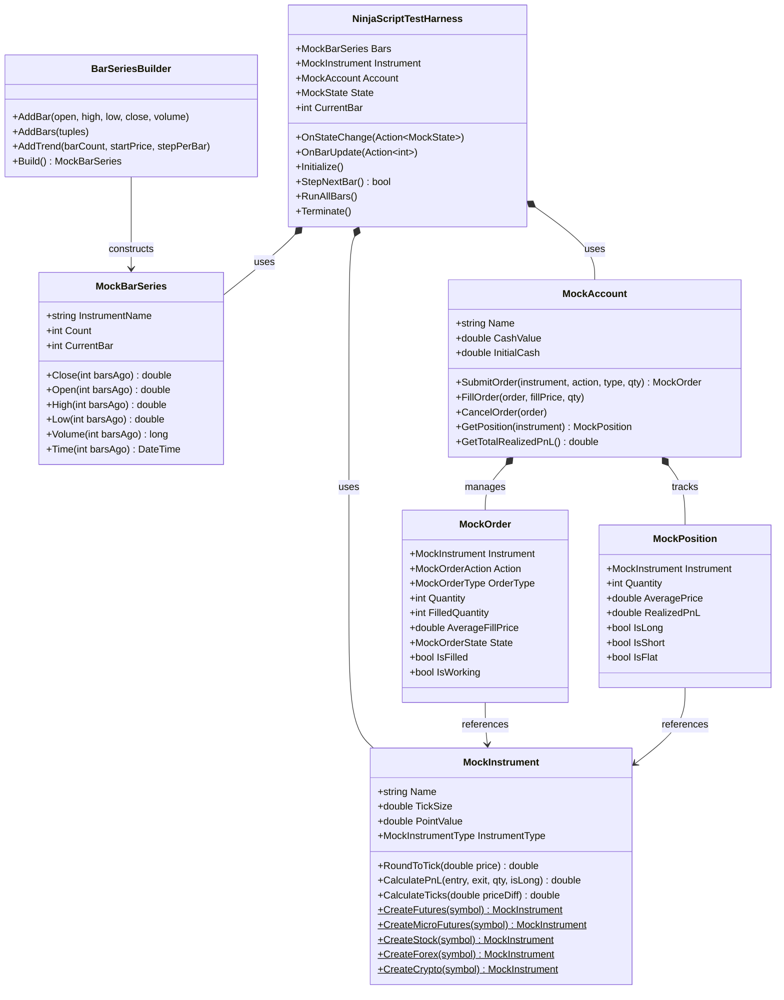
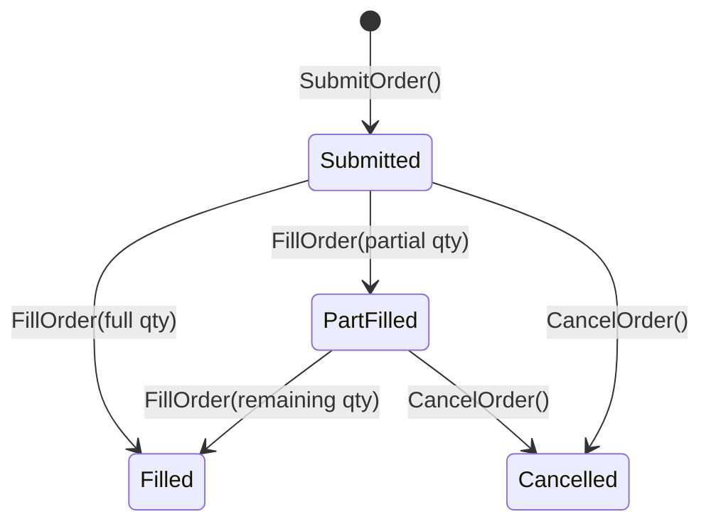

# NinjaTrader Mocking & Harness Kit

A central challenge in testing NinjaTrader 8 indicators and strategies is their tight coupling with the live chart engine and historical market data feeds. 

`NinjaTrader.UnitTest` provides a complete, decoupled mocking ecosystem in the `NinjaTrader.UnitTest.Mocking` namespace.

---

## Mocking Ecosystem Architecture



---

## 1. Synthetic Bars & Price Series

### [`BarSeriesBuilder`](file:///C:/Users/samuel/source/repos/NT/refs/ninjatrader-unittest/src/Mocking/Bars/BarSeriesBuilder.cs)

Use the fluent [`BarSeriesBuilder`](file:///C:/Users/samuel/source/repos/NT/refs/ninjatrader-unittest/src/Mocking/Bars/BarSeriesBuilder.cs) to quickly assemble OHLCV datasets:

```csharp
using NinjaTrader.UnitTest.Mocking;

MockBarSeries series = new BarSeriesBuilder(instrumentName: "ES", startTime: new DateTime(2026, 1, 1, 9, 30, 0))
    // 1. Add discrete individual bars
    .AddBar(open: 5000.00, high: 5010.50, low: 4995.00, close: 5005.25, volume: 1200)
    .AddBar(open: 5005.25, high: 5020.00, low: 5002.00, close: 5015.50, volume: 1800)

    // 2. Add multiple bars with tuple syntax
    .AddBars(
        (open: 5015.50, high: 5025.00, low: 5010.00, close: 5022.00),
        (open: 5022.00, high: 5030.00, low: 5018.00, close: 5028.75)
    )

    // 3. Add automated upward or downward price trends
    .AddTrend(barCount: 20, startPrice: 5030.00, stepPerBar: 0.50, barRange: 2.0)
    .Build();
```

### [`MockBarSeries`](file:///C:/Users/samuel/source/repos/NT/refs/ninjatrader-unittest/src/Mocking/Bars/MockBarSeries.cs) Reverse Indexing

`NinjaTrader.UnitTest` replicates NinjaTrader's native reverse-indexing notation:
- `Close(0)` accesses the **most recent** bar.
- `Close(1)` accesses **1 bar ago**.
- `Close(N)` accesses **N bars ago**.

```csharp
double currentClose  = series.Close(0);   // Most recent close
double previousClose = series.Close(1);   // 1 bar ago
double oldestClose   = series.Close(series.Count - 1); // Earliest bar
double currentHigh   = series.High(0);
double currentLow    = series.Low(0);
long currentVolume   = series.Volume(0);
DateTime barTime     = series.Time(0);
```

---

## 2. Multi-Asset Instruments & PnL Engine

The [`MockInstrument`](file:///C:/Users/samuel/source/repos/NT/refs/ninjatrader-unittest/src/Mocking/Instruments/MockInstrument.cs) class models market specifications and calculates tick quantization and dollar profit/loss.

### Preset Asset Factories

```csharp
// E-mini S&P 500 Futures ($50 point value, 0.25 tick)
MockInstrument es = MockInstrument.CreateFutures("ES", tickSize: 0.25, pointValue: 50.0);

// Micro E-mini S&P 500 Futures ($5 point value, 0.25 tick)
MockInstrument mes = MockInstrument.CreateMicroFutures("MES", tickSize: 0.25, pointValue: 5.0);

// Apple Stock ($1 point value, 0.01 tick)
MockInstrument aapl = MockInstrument.CreateStock("AAPL", tickSize: 0.01, pointValue: 1.0);

// EUR/USD Forex (100,000 lot size, 0.0001 pip)
MockInstrument eurusd = MockInstrument.CreateForex("EURUSD", tickSize: 0.0001, pointValue: 100000.0);

// Bitcoin Crypto ($1 point value, 0.01 tick)
MockInstrument btc = MockInstrument.CreateCrypto("BTCUSD", tickSize: 0.01, pointValue: 1.0);
```

### Quantization & Calculations

```csharp
// Round arbitrary price to valid instrument tick
double rounded = es.RoundToTick(5000.22); // Returns 5000.25

// Calculate number of ticks in a price movement
double ticks = es.CalculateTicks(priceDiff: 2.50); // Returns 10.0 ticks

// Calculate PnL: 2 Long contracts bought at 5000.00, sold at 5010.00
// (5010.00 - 5000.00) * $50.00 pointValue * 2 contracts = $1,000.00
double pnl = es.CalculatePnL(entryPrice: 5000.00, exitPrice: 5010.00, quantity: 2, isLong: true);
AssertEqual(1000.00, pnl);
```

---

## 3. Account, Orders & Position Tracking

[`MockAccount`](file:///C:/Users/samuel/source/repos/NT/refs/ninjatrader-unittest/src/Mocking/Accounts/MockAccount.cs) simulates an active trading account with a state machine for order submissions, partial and full fills, cancellations, and position updates.

### Order Lifecycle



### Complete Execution Example

```csharp
var instrument = MockInstrument.CreateFutures("ES", tickSize: 0.25, pointValue: 50.0);
var account = new MockAccount("SimulationAccount", initialCash: 50000.0);

// 1. Submit a Limit Buy Order
MockOrder order = account.SubmitOrder(
    instrument: instrument,
    action: MockOrderAction.Buy,
    orderType: MockOrderType.Limit,
    quantity: 4,
    limitPrice: 5000.00,
    signalName: "EntryLong"
);

AssertTrue(order.IsWorking);
AssertEqual(MockOrderState.Submitted, order.State);

// 2. Simulate Partial Fill of 2 contracts
account.FillOrder(order, fillPrice: 5000.00, quantity: 2);
AssertEqual(MockOrderState.PartFilled, order.State);
AssertEqual(2, order.FilledQuantity);

MockPosition position = account.GetPosition(instrument);
AssertTrue(position.IsLong);
AssertEqual(2, position.Quantity);
AssertEqual(5000.00, position.AveragePrice);

// 3. Fill remaining 2 contracts
account.FillOrder(order, fillPrice: 5000.00, quantity: 2);
AssertTrue(order.IsFilled);
AssertEqual(4, position.Quantity);

// 4. Submit Sell Order to Close Position
MockOrder exitOrder = account.SubmitOrder(instrument, MockOrderAction.Sell, MockOrderType.Market, quantity: 4);
account.FillOrder(exitOrder, fillPrice: 5005.00, quantity: 4);

AssertTrue(position.IsFlat);
// Realized PnL: (5005.00 - 5000.00) * $50.00 * 4 contracts = $1,000.00
AssertEqual(1000.00, position.RealizedPnL);
AssertEqual(51000.00, account.CashValue);
```

---

## 4. Indicator & Strategy Test Harness

[`NinjaScriptTestHarness`](file:///C:/Users/samuel/source/repos/NT/refs/ninjatrader-unittest/src/Mocking/Harness/NinjaScriptTestHarness.cs) replicates NinjaTrader 8's internal state machine without requiring a running UI or chart.

### Supported State Lifecycle ([`MockState`](file:///C:/Users/samuel/source/repos/NT/refs/ninjatrader-unittest/src/Mocking/Harness/MockState.cs))
1. `MockState.SetDefaults`
2. `MockState.Configure`
3. `MockState.DataLoaded`
4. `MockState.Historical`
5. `MockState.Realtime`
6. `MockState.Terminated`

### Stepping Through Calculation Logic

```csharp
public class MovingAverageIndicatorTests : TestCase
{
    public void TestIndicatorOnBarUpdate()
    {
        // 1. Build synthetic bars
        var bars = new BarSeriesBuilder("ES")
            .AddBar(5000, 5010, 4990, 5005)
            .AddBar(5005, 5015, 5000, 5010)
            .AddBar(5010, 5025, 5005, 5020)
            .Build();

        // 2. Initialize harness
        var harness = new NinjaScriptTestHarness(bars);

        var observedStates = new List<MockState>();
        var calculatedValues = new List<double>();

        harness.OnStateChange(state =>
        {
            observedStates.Add(state);
        });

        harness.OnBarUpdate(barIndex =>
        {
            // Simulate indicator calculation logic
            double close = harness.Bars.Close(0);
            calculatedValues.Add(close);
        });

        // 3. Execute all bars
        harness.RunAllBars();

        // 4. Verify transitions and computations
        AssertIn(MockState.SetDefaults, observedStates);
        AssertIn(MockState.Historical, observedStates);
        AssertEqual(3, calculatedValues.Count);
        AssertEqual(5020.0, calculatedValues[2]);
    }
}
```
