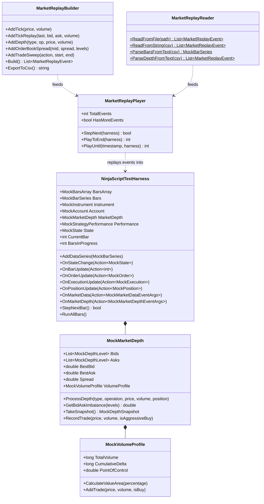

# NinjaTrader Mocking & Harness Kit

A central challenge in testing NinjaTrader 8 indicators, strategies, and Add-Ons is their tight coupling with the live desktop client, chart rendering engine, Level 2 DOM, and broker data feeds. 

`NinjaTrader.UnitTest` provides a complete, decoupled mocking ecosystem in the `NinjaTrader.UnitTest.Mocking` namespace, enabling lightning-fast **headless unit testing** in CI/CD and Visual Studio Test Explorer.

---

## Mocking Ecosystem Architecture



---

## 1. Generic Data Series ([`MockSeries<T>`](file:///C:/Users/samuel/source/repos/NT/refs/ninjatrader-unittest/src/Mocking/Series/MockSeries.cs))

NinjaTrader indicators and strategies use `Series<T>` (`Series<double>`, `Series<bool>`, `Series<string>`, etc.) to store intermediate calculation series synchronized with historical bars.

[`MockSeries<T>`](file:///C:/Users/samuel/source/repos/NT/refs/ninjatrader-unittest/src/Mocking/Series/MockSeries.cs) implements [`ISeries<T>`](file:///C:/Users/samuel/source/repos/NT/refs/ninjatrader-unittest/src/Mocking/Series/ISeries.cs) and supports native `[barsAgo]` indexing, `Set()`, `Reset()`, and `IsValidDataPoint()`:

```csharp
using NinjaTrader.UnitTest.Mocking;

// 1. Synchronized to a BarSeries
MockBarSeries bars = new BarSeriesBuilder("ES").AddTrend(10, 5000.0, 1.0).Build();
var rsiValues = new MockSeries<double>(bars);
var signalMarkers = new MockSeries<bool>(bars);

// 2. Set values on the active bar (barsAgo = 0)
rsiValues[0] = 68.5;
signalMarkers[0] = true;

// 3. Set values for historical bars (barsAgo > 0)
rsiValues[1] = 62.0;

// 4. Access and verify
AssertEqual(68.5, rsiValues[0]);
AssertEqual(62.0, rsiValues[1]);
AssertTrue(rsiValues.IsValidDataPoint(0));

// 5. Reset data point validity
rsiValues.Reset(0);
AssertFalse(rsiValues.IsValidDataPoint(0));
```

---

## 2. Multi-Timeframe & Multi-Bars ([`MockBarsArray`](file:///C:/Users/samuel/source/repos/NT/refs/ninjatrader-unittest/src/Mocking/Bars/MockBarsArray.cs))

Test multi-timeframe indicators and strategies (such as 1-minute primary + 5-minute secondary series) using [`MockBarsArray`](file:///C:/Users/samuel/source/repos/NT/refs/ninjatrader-unittest/src/Mocking/Bars/MockBarsArray.cs):

```csharp
// Primary 1-minute series
var primary1Min = new BarSeriesBuilder("ES", timeStep: TimeSpan.FromMinutes(1))
    .AddTrend(20, 5000.0, 0.50)
    .Build();
primary1Min.PeriodType = MockBarsPeriodType.Minute;
primary1Min.PeriodValue = 1;

// Secondary 5-minute series
var secondary5Min = new BarSeriesBuilder("ES", timeStep: TimeSpan.FromMinutes(5))
    .AddTrend(4, 5000.0, 2.50)
    .Build();
secondary5Min.PeriodType = MockBarsPeriodType.Minute;
secondary5Min.PeriodValue = 5;

// Build harness with multiple series
var harness = new NinjaScriptTestHarness(primary1Min);
harness.AddDataSeries(secondary5Min);

AssertEqual(2, harness.BarsArray.Count);
AssertEqual(1, harness.BarsArray[0].PeriodValue);
AssertEqual(5, harness.BarsArray[1].PeriodValue);
```

---

## 3. Advanced Orders, ATM Brackets & OCO Groups

[`MockAccount`](file:///C:/Users/samuel/source/repos/NT/refs/ninjatrader-unittest/src/Mocking/Accounts/MockAccount.cs) features an automated order execution and matching engine:

### Bracket Orders & Automatic OCO Cancellation

```csharp
var es = MockInstrument.CreateFutures("ES", tickSize: 0.25, pointValue: 50.0);
es.CommissionPerContract = 2.05;

var account = new MockAccount("AtmSim", 100000.0);

// 1. Submit Bracket: Buy 2 contracts at Market, Stop-Loss at 4990, Profit-Target at 5020
var bracket = account.SubmitBracket(
    instrument: es,
    action: MockOrderAction.Buy,
    quantity: 2,
    stopPrice: 4990.0,
    targetPrice: 5020.0,
    entrySignal: "LongEntry"
);

// 2. Fill Entry Order
account.FillOrder(bracket.EntryOrder, fillPrice: 5000.0, quantity: 2);
AssertTrue(bracket.EntryOrder.IsFilled);

// 3. When Profit-Target fills, Stop-Loss is automatically cancelled by OCO logic!
account.FillOrder(bracket.ProfitTargetOrder, fillPrice: 5020.0, quantity: 2);

AssertTrue(bracket.ProfitTargetOrder.IsFilled);
AssertTrue(bracket.StopLossOrder.IsCancelled);
AssertTrue(account.GetPosition(es).IsFlat);
```

### Automated Order Matching Against Bar Extremes

```csharp
// Submit working Buy Limit order at 5000.00
account.SubmitOrder(es, MockOrderAction.Buy, MockOrderType.Limit, 1, limitPrice: 5000.00);

// Bar low is 4998.00 (penetrates limit) -> Automatically fills at 5000.00
account.ProcessWorkingOrders(es, highPrice: 5005.0, lowPrice: 4998.0, closePrice: 5002.0);

AssertTrue(account.Orders[0].IsFilled);
```

---

## 4. Level 2 (L2) Market Depth & Order Flow Analytics

[`MockMarketDepth`](file:///C:/Users/samuel/source/repos/NT/refs/ninjatrader-unittest/src/Mocking/MarketData/MockMarketDepth.cs) maintains a real-time Level 2 order book ladder for testing SuperDOM columns, footprint charts, and order flow indicators:

```csharp
var depth = new MockMarketDepth();

// 1. Insert Bid and Ask ladders
depth.ProcessDepth(MockMarketDataType.Bid, MockMarketDepthOperation.Insert, price: 5000.25, volume: 30);
depth.ProcessDepth(MockMarketDataType.Bid, MockMarketDepthOperation.Insert, price: 5000.00, volume: 40);
depth.ProcessDepth(MockMarketDataType.Ask, MockMarketDepthOperation.Insert, price: 5000.50, volume: 15);
depth.ProcessDepth(MockMarketDataType.Ask, MockMarketDepthOperation.Insert, price: 5000.75, volume: 20);

// 2. Query Top of Book & Spread
AssertEqual(5000.25, depth.BestBid);
AssertEqual(5000.50, depth.BestAsk);
AssertAlmostEqual(0.25, depth.Spread, delta: 0.001);

// 3. Order Book Imbalance Ratio (Top 2 levels: 70 Bids vs 35 Asks -> 66.7% Bids)
double imbalance = depth.GetBidAskImbalance(levels: 2);
AssertAlmostEqual(0.6667, imbalance, delta: 0.001);

// 4. Capture Point-In-Time Depth Snapshot
MockDepthSnapshot snapshot = depth.TakeSnapshot();
AssertEqual(2, snapshot.Bids.Count);
AssertEqual(2, snapshot.Asks.Count);

// 5. Volume Profile & Order Flow Point of Control (POC)
depth.RecordTrade(price: 5000.50, volume: 200, isAggressiveBuy: true);
depth.RecordTrade(price: 5000.25, volume: 80, isAggressiveBuy: false);

AssertEqual(280, depth.VolumeProfile.TotalVolume);
AssertEqual(120, depth.VolumeProfile.CumulativeDelta); // 200 Buy - 80 Sell
AssertEqual(5000.50, depth.VolumeProfile.PointOfControl); // Heaviest volume price
```

---

## 5. Market Replay Files & Stream Playback

[`NinjaTrader.UnitTest`](file:///C:/Program%20Files/NinjaTrader%208/bin) natively supports reading, writing, and playing NinjaTrader 8 historical data and replay files (`.txt`, `.csv`):

### Supported NinjaTrader File Formats
1. **Tick Replay (Sub-second / Second)**: `yyyyMMdd HHmmss fffffff;last price;bid price;ask price;volume`
2. **Tick Trades**: `yyyyMMdd HHmmss;price;volume`
3. **Minute Bars**: `yyyyMMdd HHmmss;open;high;low;close;volume`
4. **Daily Bars**: `yyyyMMdd;open;high;low;close;volume`
5. **Level 2 Market Depth**: `yyyyMMdd HHmmss;marketDataType;operation;price;volume;position;marketMaker`

### Parsing & Playing Market Replay Files

```csharp
// 1. Parse exported NinjaTrader replay file
List<MarketReplayEvent> events = MarketReplayReader.ReadFromFile(@"C:\Data\ES_TickReplay.txt");

// 2. Initialize Harness and Player
var harness = new NinjaScriptTestHarness();
var player = new MarketReplayPlayer(events);

harness.OnMarketData(e =>
{
    Console.WriteLine($"[TICK] {e.Time}: {e.Price} (Vol: {e.Volume})");
});

// 3. Play events chronologically into harness
int eventsProcessed = player.PlayToEnd(harness);
AssertEqual(events.Count, eventsProcessed);
```

### Fluent Market Replay Builder & Order Book Sweeps

Generate deterministic tick-by-tick and Level 2 book sweep scenarios in code:

```csharp
var builder = new MarketReplayBuilder()
    // Setup initial 5-level DOM spread around 5000.00
    .AddOrderBookSpread(midPrice: 5000.00, spread: 0.50, levels: 5)
    // Aggressive buy order sweeping 4 ticks of ask liquidity
    .AddTradeSweep(MockOrderAction.Buy, startPrice: 5000.25, endPrice: 5001.00, volumePerLevel: 25);

List<MarketReplayEvent> stream = builder.Build();
string csvExport = builder.ExportToCsv(); // Can be imported into NT8 Historical Data Manager!
```

---

## 6. NinjaTrader `.nrd` Binary Replay & Real-Time Engine

`NinjaTrader.UnitTest` includes high-performance binary readers and writers for **NinjaTrader `.nrd` (NinjaTrader Replay Data)** files, along with an asynchronous, paced **Real-Time Playback Engine**:

### Reading and Writing `.nrd` Files

```csharp
var es = MockInstrument.CreateFutures("ES", tickSize: 0.25, pointValue: 50.0);

// 1. Record simulated events to an .nrd binary file
using (var writer = new NrdFileWriter(@"C:\Data\ES_Replay.nrd", es))
{
    writer.WriteEvent(MarketReplayEvent.CreateTick(DateTime.Now, 5000.25, 10, es));
    writer.WriteEvent(MarketReplayEvent.CreateDepth(DateTime.Now, MockMarketDataType.Bid, MockMarketDepthOperation.Insert, 5000.00, 25, 0, "", es));
}

// 2. Read events directly from an .nrd file with date range filtering
using (var reader = new NrdFileReader(@"C:\Data\ES_Replay.nrd"))
{
    Console.WriteLine($"Header: Symbol={reader.Header.Symbol}, Records={reader.Header.RecordCount}, Volume={reader.Header.TotalVolume}");
    foreach (var e in reader.ReadEvents())
    {
        // Process records
    }
}
```

### Real-Time Paced vs. Instant Headless Playback

[`NrdRealtimePlayer`](file:///C:/Users/samuel/source/repos/NT/refs/ninjatrader-unittest/src/Mocking/Replay/NrdRealtimePlayer.cs) allows controlling execution speed:

- `SpeedMultiplier = 0.0`: **Instant Execution** (runs millions of events in milliseconds for headless CI/CD).
- `SpeedMultiplier = 1.0`: **1x Real-Time Pacing** (waits exact millisecond delays matching the recorded event timestamps).
- `SpeedMultiplier = 5.0`: **5x Accelerated Playback**.

```csharp
var events = MarketReplayReader.ReadNrdFile(@"C:\Data\ES_Replay.nrd");
var harness = new NinjaScriptTestHarness(instrument: es);

// Create Real-Time Player with 2x speed
var player = new NrdRealtimePlayer(events, speedMultiplier: 2.0);

// Asynchronously stream events into harness with real-time delays
await player.PlayAsync(harness);
```

---

## 7. AddOn & Connection Simulation

Simulate broker and data feed connection events for Add-Ons without live credentials:

```csharp
var connection = new MockConnection("RithmicLive");

connection.ConnectionStatusChanged += (sender, e) =>
{
    if (e.Status == MockConnectionStatus.ConnectionLost)
    {
        // Add-On handles connection failover
    }
};

connection.Connect();
AssertEqual(MockConnectionStatus.Connected, connection.Status);

connection.SimulateConnectionLoss("Network adapter timeout");
AssertEqual(MockConnectionStatus.ConnectionLost, connection.Status);
```

---

## 8. Strategy Performance & Analytics

[`MockStrategyPerformance`](file:///C:/Users/samuel/source/repos/NT/refs/ninjatrader-unittest/src/Mocking/Performance/MockStrategyPerformance.cs) calculates backtest metrics as positions open and close:

```csharp
MockStrategyPerformance perf = account.Performance;

// Access comprehensive trade statistics
int totalTrades     = perf.TotalTrades;
double winRate      = perf.WinRate;        // e.g. 0.65 (65%)
double profitFactor = perf.ProfitFactor;   // GrossProfit / GrossLoss
double netProfit    = perf.NetProfit;      // Gross - Loss - Commissions
double maxDrawdown  = perf.MaxDrawdown;    // Peak-to-trough equity drop
double avgTrade     = perf.AverageTrade;

// Inspect individual round-trip trade objects
foreach (MockTrade trade in perf.Trades)
{
    Console.WriteLine($"Trade #{trade.TradeNumber}: Entry {trade.EntryPrice} -> Exit {trade.ExitPrice}, PnL: ${trade.NetProfit:F2}, MAE: ${trade.MaxAdverseExcursion:F2}");
}
```
