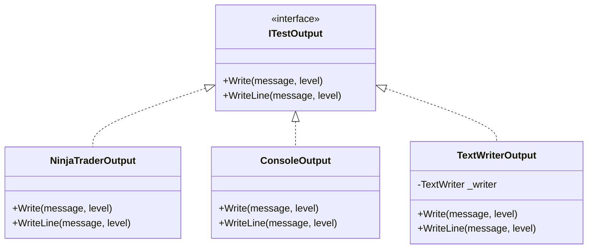

# Test Runners, Discovery & Logging

`NinjaTrader.UnitTest` provides automated test discovery via [`TestLoader`](file:///C:/Users/samuel/source/repos/NT/refs/ninjatrader-unittest/src/Discovery/TestLoader.cs), test execution via [`TextTestRunner`](file:///C:/Users/samuel/source/repos/NT/refs/ninjatrader-unittest/src/Results/TextTestRunner.cs), and pluggable output adapters that dynamically route logs to the NinjaTrader Output Window, Console, or custom text streams.

---

## 1. Automatic Test Discovery ([`TestLoader`](file:///C:/Users/samuel/source/repos/NT/refs/ninjatrader-unittest/src/Discovery/TestLoader.cs))

[`TestLoader`](file:///C:/Users/samuel/source/repos/NT/refs/ninjatrader-unittest/src/Discovery/TestLoader.cs) uses reflection to inspect classes and assemblies, assembling matching test methods into a [`TestSuite`](file:///C:/Users/samuel/source/repos/NT/refs/ninjatrader-unittest/src/Execution/TestSuite.cs).

### Discovery Modes

```csharp
using NinjaTrader.UnitTest;

// 1. Load from a generic TestCase class:
TestSuite suite1 = TestLoader.LoadTestsFromTestCase<SimpleMovingAverageTests>();

// 2. Load from a Type instance:
TestSuite suite2 = TestLoader.LoadTestsFromTestCase(typeof(SimpleMovingAverageTests));

// 3. Load all TestCase classes in an entire Assembly:
TestSuite suite3 = TestLoader.LoadTestsFromAssembly(typeof(SimpleMovingAverageTests).Assembly);

// 4. Load specific tests by qualified name (ClassName.MethodName):
TestSuite suite4 = TestLoader.LoadTestsFromNames(new[]
{
    "SimpleMovingAverageTests.TestMovingAverageCalculation",
    "SimpleMovingAverageTests.TestExceptionThrownOnInvalidPeriod"
});
```

### Method Recognition Rules

A method is recognized as a runnable test if:
1. It is `public`, `instance`, and parameterless, **AND**
2. Its name starts with `Test` or `test_` (case-insensitive), **OR**
3. It is decorated with `[Test]` or `[TestMethod]`.

---

## 2. Test Runner ([`TextTestRunner`](file:///C:/Users/samuel/source/repos/NT/refs/ninjatrader-unittest/src/Results/TextTestRunner.cs))

The [`TextTestRunner`](file:///C:/Users/samuel/source/repos/NT/refs/ninjatrader-unittest/src/Results/TextTestRunner.cs) orchestrates suite execution, manages lifecycle transitions, and formats diagnostics.

### Static Helper Execution

```csharp
// Run with default options (verbosity 1)
TestResult result1 = TextTestRunner.Run(suite);

// Run with verbose output (verbosity 2)
TestResult result2 = TextTestRunner.Run(suite, verbosity: 2);

// Run with fail-fast enabled
TestResult result3 = TextTestRunner.Run(suite, failfast: true);
```

### Instance-Based Execution

```csharp
var runner = new TextTestRunner(verbosity: 2, failfast: false, stream: Console.Out);
TestResult result = runner.Run(suite);
```

---

## 3. Verbosity Levels

| Level | Name | Output Characteristics |
| :--- | :--- | :--- |
| `0` | **Quiet** | Compact summary characters (`.` for pass, `F` for failure, `E` for error, `s` for skip, `x` for expected failure) followed by the final summary line. |
| `1` | **Standard** (Default) | Test execution progress with total elapsed time, test count, and full stack traces for any failures/errors. |
| `2` | **Verbose** | Real-time line-by-line logging displaying each test name and its individual status (`... OK`, `... FAIL`, `... ERROR`, `... SKIPPED`), plus subtest breakdowns. |

---

## 4. Fail-Fast Mode

When `failfast: true` is configured, the test runner halts immediately upon encountering the first failure, error, or unexpected success:

```csharp
var runner = new TextTestRunner(verbosity: 2, failfast: true);
TestResult result = runner.Run(suite);
```

---

## 5. Result Aggregation ([`TestResult`](file:///C:/Users/samuel/source/repos/NT/refs/ninjatrader-unittest/src/Results/TestResult.cs))

[`TestResult`](file:///C:/Users/samuel/source/repos/NT/refs/ninjatrader-unittest/src/Results/TestResult.cs) collects all telemetry during suite execution:

```csharp
TestResult result = TextTestRunner.Run(suite);

bool passed          = result.WasSuccessful;        // True if 0 failures and 0 errors
int totalRan         = result.RunCount;             // Total completed test methods
int failuresCount    = result.Failures.Count;       // Assertion failures
int errorsCount      = result.Errors.Count;         // Unhandled runtime exceptions
int skipsCount       = result.Skipped.Count;        // Skipped tests
int expFailuresCount = result.ExpectedFailures.Count;
int unexpPassesCount = result.UnexpectedSuccesses.Count;
double durationSec   = result.Duration;             // Total execution time in seconds
```

---

## 6. Pluggable Output Logging System

`NinjaTrader.UnitTest` abstracts all logging through the [`ITestOutput`](file:///C:/Users/samuel/source/repos/NT/refs/ninjatrader-unittest/src/Output/Abstractions/ITestOutput.cs) interface.

### [`ITestOutput`](file:///C:/Users/samuel/source/repos/NT/refs/ninjatrader-unittest/src/Output/Abstractions/ITestOutput.cs) Interface

```csharp
public interface ITestOutput
{
    void Write(string message, OutputLevel level = OutputLevel.Information);
    void WriteLine(string message, OutputLevel level = OutputLevel.Information);
}
```

### Built-In Output Adapters



1. **[`NinjaTraderOutput`](file:///C:/Users/samuel/source/repos/NT/refs/ninjatrader-unittest/src/Output/NinjaTraderOutput.cs)**: Emits formatted messages directly to `NinjaTrader.NinjaScript.NinjaScript.Log` using NinjaTrader's native log levels (`LogLevel.Information`, `LogLevel.Warning`, `LogLevel.Error`).
2. **[`ConsoleOutput`](file:///C:/Users/samuel/source/repos/NT/refs/ninjatrader-unittest/src/Output/ConsoleOutput.cs)**: Writes output to `System.Console` (standard stdout / stderr).
3. **[`TextWriterOutput`](file:///C:/Users/samuel/source/repos/NT/refs/ninjatrader-unittest/src/Output/TextWriterOutput.cs)**: Adapts any `System.IO.TextWriter` (e.g., `StringWriter`, `StreamWriter`, file logger).

### Auto-Detection & Custom Configuration

[`TestOutputHelper`](file:///C:/Users/samuel/source/repos/NT/refs/ninjatrader-unittest/src/Output/TestOutputHelper.cs) automatically detects if NinjaTrader is available in the current AppDomain. If NinjaTrader assemblies are present, it selects [`NinjaTraderOutput`](file:///C:/Users/samuel/source/repos/NT/refs/ninjatrader-unittest/src/Output/NinjaTraderOutput.cs); otherwise, it falls back to [`ConsoleOutput`](file:///C:/Users/samuel/source/repos/NT/refs/ninjatrader-unittest/src/Output/ConsoleOutput.cs).

You can override the default output target globally or per runner instance:

```csharp
using (var stringWriter = new System.IO.StringWriter())
{
    // Direct runner output to in-memory string writer
    var runner = new TextTestRunner(verbosity: 2, stream: stringWriter);
    runner.Run(suite);

    string capturedLog = stringWriter.ToString();
}
```
