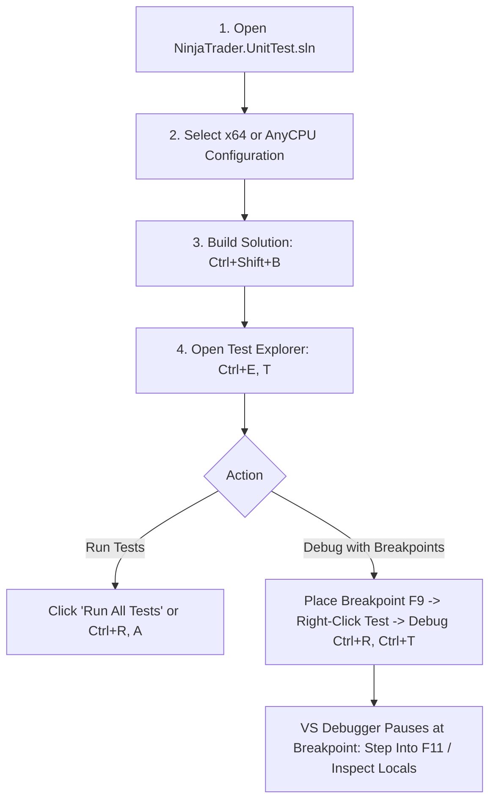
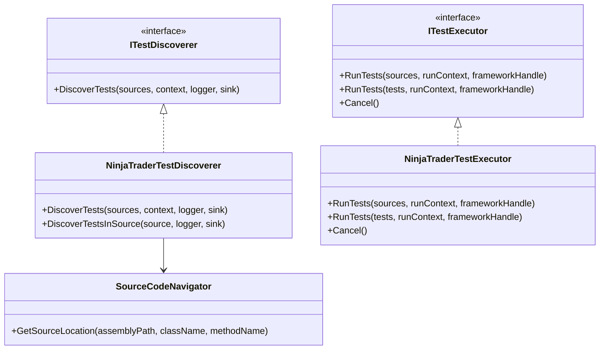

# Visual Studio Community Test Explorer & Debugging Guide

`NinjaTrader.UnitTest` includes a native Visual Studio Test Adapter ([`NinjaTrader.UnitTest.TestAdapter`](file:///C:/Users/samuel/source/repos/NT/refs/ninjatrader-unittest/NinjaTrader.UnitTest.TestAdapter/NinjaTrader.UnitTest.TestAdapter.csproj)) that implements Microsoft's **VSTest** platform (`Microsoft.TestPlatform.ObjectModel`). 

This provides seamless, out-of-the-box integration with **Visual Studio 2022 Community Edition** (as well as Professional and Enterprise), allowing you to discover, run, filter, and **debug tests with breakpoints** directly inside the graphical **Test Explorer** interface.

---

## 🎯 Features in Visual Studio Community

- **Native Test Explorer Integration:** Zero third-party extensions required; test classes are automatically detected after compilation.
- **Graphical Debugging (F5 / Breakpoints):** Set breakpoints in test methods, `SetUp()`, `TearDown()`, indicators, strategies, or mocks, and debug directly with the Visual Studio debugger.
- **Click-to-Source Navigation:** Double-clicking any test in Test Explorer immediately opens the `.cs` file and jumps to the exact method declaration line.
- **Live Output & SubTest Diagnostics:** Inspect console output, assertion diffs, and parameterized subtest results directly in the Test Detail pane.
- **Continuous / Live Testing:** Compatible with Visual Studio's "Run Tests After Build".

---

## 🛠️ Visual Studio 2022 Community Prerequisites

To develop, build, and debug tests in Visual Studio Community 2022:

1. **Visual Studio 2022 Community** installed.
2. In the **Visual Studio Installer**, ensure the following workloads and individual components are checked:
   - Workload: **.NET desktop development**
   - Individual Component: **.NET Framework 4.8 targeting pack / developer pack**
   - Individual Component: **C# and Visual Basic Roslyn compilers**

---

## 🚀 Step-by-Step Guide: Running & Debugging in Visual Studio Community



### Step 1: Open the Solution
Launch **Visual Studio 2022 Community** and open [`NinjaTrader.UnitTest.sln`](file:///C:/Users/samuel/source/repos/NT/refs/ninjatrader-unittest/NinjaTrader.UnitTest.sln).

### Step 2: Configure Architecture
Because NinjaTrader 8 is a 64-bit platform, configure the default test architecture to 64-bit:
1. In the top toolbar, set the Solution Configuration to **Debug** or **Release** and Platform to **x64** (or **Any CPU**).
2. Go to the Visual Studio menu: **Test** -> **Configure Run Settings** -> **Default Processor Architecture** -> select **X64**.

### Step 3: Build the Solution
Press **`Ctrl+Shift+B`** (or menu **Build** -> **Build Solution**).
Visual Studio will build:
1. `NinjaTrader.UnitTest.dll` (Core framework and test cases).
2. `NinjaTrader.UnitTest.TestAdapter.dll` (Visual Studio VSTest discovery and execution engine).

### Step 4: Open the Test Explorer Window
Open Test Explorer using either method:
- Keyboard Shortcut: **`Ctrl+E, T`**
- Top Menu: **Test** -> **Test Explorer**

All 23 unit tests from [`NinjaTrader.UnitTest`](file:///C:/Users/samuel/source/repos/NT/refs/ninjatrader-unittest/NinjaTrader.UnitTest.csproj) will populate the tree, grouped logically by Project, Namespace, and Class.

---

## 🔍 How to Debug with Breakpoints in Visual Studio Community

Debugging an algorithmic trading strategy, custom indicator, or order lifecycle test is straightforward:

### 1. Place a Breakpoint
Open the test source file you wish to debug (for example, [`tests/Mocking/MockAccountAndOrderTests.cs`](file:///C:/Users/samuel/source/repos/NT/refs/ninjatrader-unittest/tests/Mocking/MockAccountAndOrderTests.cs) or [`tests/Mocking/NinjaScriptTestHarnessTests.cs`](file:///C:/Users/samuel/source/repos/NT/refs/ninjatrader-unittest/tests/Mocking/NinjaScriptTestHarnessTests.cs)).

Click in the left gray margin next to the line where you want execution to pause (or press **`F9`** on that line). A red circle will appear indicating an active breakpoint.

### 2. Launch Test Debugging
In the **Test Explorer** window:
- Right-click the specific test method -> select **Debug** (or press **`Ctrl+R, Ctrl+T`**).

Visual Studio will start the test runner process with the CLR debugger attached. Execution will halt immediately when your breakpoint is hit!

### 3. Inspect State & Step Through Code
While paused at your breakpoint, use Visual Studio Community's interactive debugging tools:

| Tool / Window | Shortcut | Description |
| :--- | :--- | :--- |
| **Step Over** | `F10` | Executes the current line and steps to the next line in the same method. |
| **Step Into** | `F11` | Steps inside the method call being invoked (e.g. into `account.FillOrder()` or indicator code). |
| **Step Out** | `Shift+F11` | Finishes executing the current method and returns to the calling method. |
| **Locals Window** | `Ctrl+Alt+V, L` | Displays all variables in local scope, their current properties, and object graphs. |
| **Watch Window** | `Ctrl+Alt+W, 1` | Evaluate custom expressions continuously (e.g. `account.CashValue`, `bars.Close(0)`). |
| **Immediate Window** | `Ctrl+Alt+I` | Execute arbitrary C# code statements while paused in the debugger. |
| **Call Stack** | `Ctrl+Alt+C` | View the exact chain of method calls leading up to the current breakpoint. |

---

## ⌨️ Visual Studio Keyboard Shortcuts Cheat Sheet

| Action | Shortcut |
| :--- | :--- |
| **Open Test Explorer** | `Ctrl+E, T` |
| **Run All Tests in Solution** | `Ctrl+R, A` |
| **Run Selected Test(s)** | `Ctrl+R, T` |
| **Debug Selected Test(s)** | `Ctrl+R, Ctrl+T` |
| **Repeat Last Test Run** | `Ctrl+R, L` |
| **Toggle Breakpoint** | `F9` |
| **Continue Execution** | `F5` |
| **Step Over** | `F10` |
| **Step Into** | `F11` |
| **Step Out** | `Shift+F11` |

---

## 🏗️ Technical Architecture of the Test Adapter

The [`NinjaTrader.UnitTest.TestAdapter`](file:///C:/Users/samuel/source/repos/NT/refs/ninjatrader-unittest/NinjaTrader.UnitTest.TestAdapter/NinjaTrader.UnitTest.TestAdapter.csproj) project connects Visual Studio's TestPlatform to the `NinjaTrader.UnitTest` framework:



### Components

1. **[`NinjaTraderTestDiscoverer`](file:///C:/Users/samuel/source/repos/NT/refs/ninjatrader-unittest/NinjaTrader.UnitTest.TestAdapter/NinjaTraderTestDiscoverer.cs):**
   - Implements `Microsoft.VisualStudio.TestPlatform.ObjectModel.Adapter.ITestDiscoverer`.
   - Scans assemblies for classes inheriting from [`TestCase`](file:///C:/Users/samuel/source/repos/NT/refs/ninjatrader-unittest/src/Execution/TestCase.cs) or decorated with `[Test]` / `[TestMethod]`.
   - Reads PDB debug symbols via [`SourceCodeNavigator`](file:///C:/Users/samuel/source/repos/NT/refs/ninjatrader-unittest/NinjaTrader.UnitTest.TestAdapter/SourceCodeNavigator.cs) to provide line-number navigation in the UI.

2. **[`NinjaTraderTestExecutor`](file:///C:/Users/samuel/source/repos/NT/refs/ninjatrader-unittest/NinjaTrader.UnitTest.TestAdapter/NinjaTraderTestExecutor.cs):**
   - Implements `Microsoft.VisualStudio.TestPlatform.ObjectModel.Adapter.ITestExecutor`.
   - Executes tests and maps [`TestResult`](file:///C:/Users/samuel/source/repos/NT/refs/ninjatrader-unittest/src/Results/TestResult.cs) telemetry into VSTest `TestOutcome` (`Passed`, `Failed`, `Skipped`, `NotFound`).
   - Streams live output, assertion errors, and failure stack traces in real time to Visual Studio's `IFrameworkHandle`.

3. **[`SourceCodeNavigator`](file:///C:/Users/samuel/source/repos/NT/refs/ninjatrader-unittest/NinjaTrader.UnitTest.TestAdapter/SourceCodeNavigator.cs):**
   - Resolves symbol data from PDB files so Test Explorer can navigate directly to the C# source code on double-click.

---

## 💻 Running via Command Line (`vstest.console.exe`)

You can also run tests from the Developer Command Prompt or PowerShell using `vstest.console.exe`:

```powershell
# Locate vstest.console.exe (Visual Studio 2022)
$vstest = "C:\Program Files (x86)\Microsoft Visual Studio\2022\BuildTools\Common7\IDE\Extensions\TestPlatform\vstest.console.exe"

# Execute tests through the NinjaTrader TestAdapter
& $vstest "bin\x64\Release\NinjaTrader.UnitTest.dll" /TestAdapterPath:"NinjaTrader.UnitTest.TestAdapter\bin\x64\Release" /Platform:x64
```

---

## ⚙️ Visual Studio Community Troubleshooting

- **Tests not appearing in Test Explorer:**
  1. Build the solution (**Build** -> **Build Solution** or `Ctrl+Shift+B`).
  2. Click the **Run All Tests** icon in Test Explorer.
  3. Ensure the test architecture is set to **X64** (**Test** -> **Configure Run Settings** -> **Default Processor Architecture** -> **X64**).
- **Breakpoints not hitting:**
  1. Make sure you select **Debug** (not Run) in Test Explorer (`Ctrl+R, Ctrl+T`).
  2. Ensure PDB files exist alongside the DLLs in `bin/x64/Debug/` or `bin/x64/Release/`.
  3. In Visual Studio, verify that **Tools** -> **Options** -> **Debugging** -> **General** -> **Enable Just My Code** is checked (recommended).
